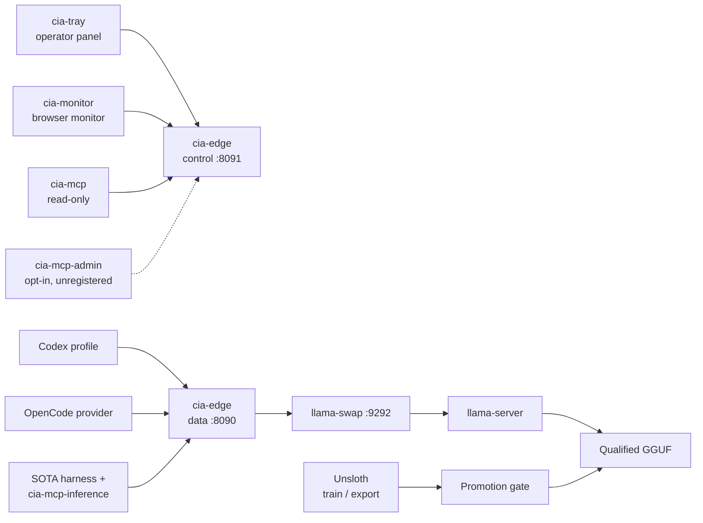

# Local AI Provider

**[Português](README.md)** · **English**

**A loopback-only, OpenAI-compatible inference server that lets coding agents run against a local model — without source code, prompts, or credentials ever leaving the machine.**

[](https://go.dev/)
[](LICENSE)
[](#hardware-baseline)
[](https://github.com/Sitr3n01/IA_local_server/actions/workflows/ci.yml)
[](#project-status)

---

## The problem

Coding harnesses like Codex, Claude Code, and OpenCode send prompts to a cloud provider — and a prompt is rarely just a question. It carries source code, file trees, directory structure, and tool schemas.

Pointing those harnesses at a local model looks trivial: expose an OpenAI-compatible endpoint and change the base URL. Done badly, that shim quietly reintroduces every risk it was meant to remove:

- it **forwards the client's bearer token** upstream, because proxies copy headers by default;
- it **falls back to the cloud** when the local model errors, so failure silently becomes exfiltration;
- it **logs request bodies** for debugging, so prompts and credentials land in plaintext on disk;
- it **binds to `0.0.0.0`**, so every device on the network can reach the inference API.

This repository is the careful version of that shim. Each of those four failures is a tested, enforced invariant here — the third one because it actually happened to the v1 prototype, and the [incident is documented in the open](incident-reports/2026-07-20-panel-zstd-credential-exposure.md).

## What it is

A Go control plane in front of `llama.cpp`, plus the Windows plumbing needed to run it as a real, supervised service:

| Concern | Owner |
|---|---|
| Agent loop, context, tool execution, retries | **The harness** — never this server |
| AuthN/Z, validation, queueing, cancellation, protocol adaptation | `cia-edge` |
| Lazy model start, one-model lifecycle, idle unload | `llama-swap` |
| Token generation | `llama-server` on AMD ROCm |
| Credential storage, process containment, restart backoff | `cia-supervisor` + Windows Credential Manager |

The deliberate scope limit is the point: this is an **inference and admission-control plane**, not an agent framework. It has no conversation history, no prompt store, no model chooser, and no network path to any cloud provider.

> **On the `cia-` prefix:** it stands for the install root `C:\IA` (*IA* = *inteligência artificial* in Portuguese). No relation to the agency.

## Architecture



Requests enter on loopback only. The edge strips the client's `Authorization` header, validates the payload against a route-specific contract, injects a *separate* router credential, and streams upstream bytes back incrementally with cancellation propagation. An unknown route, unknown model, unsupported encoding, or malformed tool shape **fails closed** — there is no second opinion to fall back to.

Full detail: [Architecture](docs/ARCHITECTURE.md) · [Threat model](docs/THREAT_MODEL.md) · [Runbook](docs/RUNBOOK.md) · [Tuning](docs/TUNING.md) · [ADRs](docs/adr/)

## Security invariants

These are enforced in code and asserted by tests, not just documented:

| Invariant | How it is enforced |
|---|---|
| Every listener is literal loopback | Config rejects `0.0.0.0`, `::`, and LAN addresses; installation audit inspects live listeners |
| Client credentials never reach the model | Edge removes `Authorization` and cookies; verified against a fake upstream in integration tests |
| Three independent secrets | Distinct inference / admin / router credentials in Windows Credential Manager |
| No cloud fallback, ever | No remote upstream is reachable; route + model allowlists; outbound firewall deny rules |
| Logs are metadata-only | Request ID, method, sanitized route, status, latency. Never prompts, bodies, headers, or tokens |
| Bounded decompression | 16 MiB wire / 64 MiB decoded / 100:1 expansion ceiling on identity, gzip, and zstd |
| Bounded concurrency | Defaults: one active inference, up to 16 queued, and a 120 s wait; overflow or timeout returns `429` with `Retry-After`. Bounded body reading happens before the wait and has its own concurrency limit |
| Direct model access is authenticated | `llama-server` requires the router key file; unauthenticated inference on the dynamic port returns `401` |
| No secrets on command lines | Supervisor injects into a process-local environment allowlist |
| Nothing sensitive in Git | CI rejects tracked binaries and weights; Gitleaks scans full history |

The privilege split is deliberate at every layer: the control plane is a separate listener from the data plane, the administrative MCP is a **separate executable that is never registered by default**, and the operator panel reads the admin credential only on an explicit mutation — its periodic status poll is unauthenticated and sanitized, so a loopback impostor has no unattended capture path.

## Components

| Executable | Purpose | Exposure |
|---|---|---|
| `cia-edge` | Data + control plane: auth, validation, queue, streaming | `127.0.0.1:18090` / `:18091` (canary); `:8090` / `:8091` (final) |
| `cia-supervisor` | Job Object containment, 1–15 min exponential restart backoff | Scheduled-task action |
| `cia-tray` | IA Local: native icon and flyout in the monitor's design — starts and stops the server, status, load/switch/unload, opens the monitor and the clients | Notification area; the only startup entry |
| `cia-monitor` | Browser monitor — request phase, tokens/s, GPU, RAM, commit; load/unload a model behind a native confirmation | `127.0.0.1:18095` (canary) / `:8095` (final) |
| `cia-credential` | Windows Credential Manager helper | Local process only |
| `cia-mcp` | Read-only operational MCP (5 side-effect-free tools) | Harness stdio |
| `cia-mcp-inference` | One stateless, text-only delegation tool for SOTA harnesses | Harness stdio |
| `cia-mcp-admin` | Lifecycle administration MCP | **Not registered by default** |
| `cia-mcp-smoke` | Live probe of the installed `cia-mcp-inference`: MCP handshake, single-tool surface, exact synthetic marker; metadata-only report | Operator; launches the MCP server as a stdio child |
| `cia-manifest` | JSON Schema validation of the versioned model manifest | Operator / CI |
| `cia-fork-gate` | Provenance gate: decides whether a pinned `buun-llama-cpp` commit may be built and adopted as the Qwen3.8 agentic runtime; never loads a model, opens a port, or reaches the network | Operator, via `Build-V2ForkRuntime.ps1` |

## Engineering practices

**Testing.** The Go suite covers credentials, body limits, queueing, cancellation, model capabilities, protocol adaptation, and negative authorization paths. Transport tests use disposable Windows pipes. The monitor page has its own lint and DOM tests in `frontend/`. Run `go test ./cmd/... ./internal/...` and, in `frontend`, `npm run lint:monitor` and `npm run test:monitor`; obtain counts and coverage from the current run.

**CI.** The jobs in [ci.yml](.github/workflows/ci.yml) validate PowerShell and harnesses; Go with formatting/vet/[Staticcheck](https://staticcheck.dev/)/[govulncheck](https://go.dev/blog/govulncheck) and a [CycloneDX SBOM](https://cyclonedx.org/); races in the portable core; fork provenance; secrets with [Gitleaks](https://github.com/gitleaks/gitleaks); and the monitor page's lint and DOM tests. A dedicated step fails the build if a `.gguf`, `.safetensors`, `.exe`, or archive is ever tracked.

**Decision records.** The [ADRs](docs/adr/) document the *why* behind the architecture, including admission, manifest/promotion, artifact security, offload, the browser monitor, and the local Claude instance. Consult the current records to distinguish active components from those retained for compatibility.

**Reproducibility.** Direct and transitive modules are pinned, and [go.mod](go.mod) sets the toolchain floor to `go 1.26.6`. CI resolves its Go version from that file. Deployment never copies from the worktree: release candidates build into a staging area, are reviewed by SHA-256, then install atomically into a protected directory.

**Preview-first operations.** The PowerShell deployment scripts in [scripts/v2](scripts/v2/) preview by default; changes require an explicit `-Apply`, and the Start-V2 launchers start a process only with `-Run`. Firewall and ACL changes additionally require an elevated shell and write a pre-change SDDL recovery record. `New-V2ClientCatalogs.ps1` is not a deployment script: it rewrites the tracked client catalogs directly.

**Qualified capabilities.** Before taking the inference slot, the edge checks the route and requested features against the model's `capabilities`. On the OpenAI routes (`/v1/chat/completions`, `/v1/responses`), requests requiring unqualified Responses, streaming, tools, structured output, or reasoning return `400 unsupported_feature`. On `/v1/messages`, unqualified chat or streaming, a required tool choice, or tool history returns `invalid_request_error`, and optional tool definitions are omitted for a model without function calling. An edge route's existence does not qualify manifest models. The Anthropic adapter preserves or refuses explicit tool choices and reports interrupted streams as errors rather than normal completion.

## Model promotion gate

Models do not become available by existing on disk. They move through an explicit state machine:

```text
candidate ──▶ qualified ──▶ enabled ──▶ retired
    ▲             │
    └─────────────┘  regression requires requalification
```

`candidate` runs only on canary ports. Reaching `qualified` requires immutable SHA-256 hashes, license and provenance records, protocol contract tests, measured RAM/commit/VRAM envelopes, failure-recovery evidence, and soak results. The production config generator **refuses to emit a `candidate` model** — see [Model promotion](docs/MODEL_PROMOTION.md).

## Project status

**v2 canary. Production promotion is intentionally blocked.** The Go edge, MCP servers, manifest, lifecycle router, credential helper, supervisor, operator panel, deployment scripts, tests, and documentation are implemented and passing. What passed canary validation: native Responses, true SSE streaming, Chat Completions, zstd, function calling, queue overflow, cancellation, TTL/unload, MCP discovery, router/edge restart, and Job Object containment. Edge p95 overhead measured within noise and below the 50 ms gate.

The 2026-10-01 review corrected launchers, protocol contracts, and memory
admission during model swaps. Qwen Agent completed a real Codex session that
fixed a Go fixture and ran its tests, preserving the original tests. Deep and
Agent passed native Responses and tool contracts; Gemma passed plain Responses
and still has no qualified tools. The Huge profile's current physical
revalidation and production artifact qualification/publication remain pending.
Results, limitations, and exceptions are recorded in the
[readiness review](docs/reports/2026-10-01-deploy-readiness.md).

The project owner explicitly waived the 72-hour soak for this 2026-10-01 review. Its result is recorded as `waived`, without evidence of prolonged stability. The four active models are the definitive project roster; declared capabilities and memory reserves still require evidence and validation. See the decision in [Model promotion](docs/MODEL_PROMOTION.md).

## Qwen profiles

Three profiles, three purposes. Select by model id; switching profiles is a
model swap in llama-swap, not a reconfiguration.

| Profile | Weights | KV | Context | Output | When to use |
|---|---|---|---:|---:|---|
| `qwen38-27b-deep-32k` | Qwen3.8 27B UD-IQ4_XS | `q8_0`/`q8_0` | 32k | 8k | Hard, localized tasks: algorithms, architecture, a complex bug in a few files |
| **`qwen38-27b-agent-128k`** | Qwen3.8 27B UD-Q3_K_XL | `q4_0`/`q4_0` | 128k | 8k | **Daily default.** Codex, Claude Code, OpenCode, Unity, refactors, repository investigation |
| `qwen36-35b-a3b-huge-256k` | Qwen3.6 35B-A3B UD-Q2_K_XL | `q4_0`/`q4_0` | 256k | 16k | Huge active context. Sparse MoE: 35B parameters, 3B active per token |

Selection rule: **reasoning reliability → Deep. Normal agent work → Agent. Huge
active context → Huge.** Choose Huge when the *working set* exceeds Agent's, not
when the task is merely hard.

The Huge profile stopped being a dense 2-bit Qwen3.8 and became an MoE on
2026-08-25. A model that activates 3B of 35B parameters holds the same window
with more throughput at depth, which is exactly what a giant-context profile
exists for. The decision, the head-to-head that produced it, and what was
deleted from disk are in
[FINAL-ROSTER-20260825](docs/reports/FINAL-ROSTER-20260825.md) and
[ADR 0016](docs/adr/0016-one-moe-and-the-four-function-roster.md).

Huge carries `reasoning_budget: 6144` under an `n_predict: 16384` ceiling. That
is not decoration: without the budget, this model spends all 8,192 tokens
thinking and returns an empty answer on the hardest coding tasks — three cases
in thirty-four, measured.

The daily default is Agent, not Deep: a coding harness spends tens of thousands
of tokens on the system prompt, tool definitions, files, logs, and history
before the problem arrives.

Details, measured evidence, and known limitations: [TUNING §1.8](docs/TUNING.md)
and [RUNBOOK §13](docs/RUNBOOK.md). Retention measurements exist for Agent in
the 2026-08-23 [qualification campaign](docs/reports/QUALIFICATION-CAMPAIGN-20260823.md)
and for the current Huge (Qwen3.6) in the 2026-08-25
[roster report](docs/reports/FINAL-ROSTER-20260825.md); the campaign's Huge row
is the retired dense Qwen3.8 profile. Full qualification of the artifacts and of
the current configuration remains recorded separately from the choice of the
four definitive models.

## Hardware baseline

Developed against AMD ROCm on Windows. The runtime is pinned by measured SHA-256 rather than by its directory label, because vendor archive names have proven unreliable as version identity. Benchmark methodology and recorded results: [Benchmarks](docs/BENCHMARKS.md).

## Build

```bash
go test -race ./...
go vet ./...
go build -trimpath -o bin/cia-edge.exe ./cmd/cia-edge
go build -trimpath -ldflags="-H=windowsgui" -o bin/cia-tray.exe ./cmd/cia-tray
```

Remaining binaries follow the same pattern under `./cmd/`. These are disposable developer outputs — deployment uses the staged, hash-reviewed path described in the [Runbook](docs/RUNBOOK.md).

## Deployment

Scripts preview by default; mutation is always a separate, explicit invocation.

```powershell
# Validate tracked model and harness metadata
.\scripts\v2\Test-V2Manifest.ps1
.\scripts\v2\Test-V2HarnessConfig.ps1

# Initialize only missing secrets; existing credentials are preserved
.\scripts\v2\Initialize-V2Secrets.ps1 -Apply

# Preview, then generate the canary deployment
.\scripts\v2\New-V2Config.ps1 -Environment Canary
.\scripts\v2\New-V2Config.ps1 -Environment Canary -Apply
```

## Browser monitor

`cia-monitor` serves a page on loopback that shows, every second, what the server is doing: the request's phase (queued, loading the model, reading the prompt, generating), tokens per second, time to first token, cache reuse and context fill, alongside GPU, VRAM, shared memory, CPU, RAM, commit and disk.

It does not depend on the edge to see the machine: it shows the power the GPU draws (watts, temperature, clocks and energy accumulated over the session), which processes use the GPU, and which other tools are serving a model — LM Studio / Bionic, Ollama, standalone llama.cpp and OpenAI-compatible servers — with model, quantization and context window when the tool's API reports them, and it flags activity even while the edge is down (ADR 0020). For traffic through the edge, per-request speed comes from the edge's telemetry; for other tools' llama.cpp servers (LM Studio / Bionic, or a `llama-server` started with `--log-file`) the monitor reads the counters the server itself writes to its log — prompt, cache, output, tokens per second, time to first token — without reading any text, and shows everything in the same table, with the serving source (the edge or the tool) named under each model. Tools without a per-request log (Ollama, for example) appear as "externa" (external: duration, peak GPU and power, board energy), and the source's card explains why. For a model another tool loaded, each source has an "Encerrar processo do modelo" (end the model's process) button, which asks for confirmation in a Windows dialog.

`/api/snapshot` includes `requests[]`, a bounded list of recent records with per-request metrics from both origins, and `coverage`, which distinguishes measured external sources from those that show activity only. Each record states where each number came from in `measurements`; prompt and cache computed from the log and estimated speeds are labeled, and missing values stay `null`. That coverage refers to the detected sources: a tool that neither goes through the edge nor publishes per-response metrics or a log cannot be counted exactly from the GPU alone.

The page can also load a chosen model and unload the loaded one — and nothing else. Each request goes over the edge's administrative pipe, with no credential, and runs only after you confirm it in a Windows dialog the page cannot reach (Cancel is the default; with no answer in 45 s, nothing happens). The monitor accepts these requests only from its own page, from a process of the same user that runs the server. `-admin-pipe off` removes the buttons. Starting and stopping the server belong to `cia-tray` (IA Local); drain and resume belong to `cia-mcp-admin` and the release transaction.

```powershell
go build -trimpath -o bin/cia-monitor.exe ./cmd/cia-monitor
.\bin\cia-monitor.exe -open                      # canary: http://127.0.0.1:18095
.\bin\cia-monitor.exe -environment final -open   # final:  http://127.0.0.1:8095
```

Per-request numbers come from the edge's `/api/v1/inference`; against an edge that predates the route the page keeps working and says telemetry is unavailable. Running `-open` while a monitor is already up just opens the existing page. Decision and controls: [ADR 0019](docs/adr/0019-browser-monitor.md).

Harness integration templates live under [`integrations/`](integrations/) and contain no secrets. Codex keeps its normal OpenAI login untouched — local access is an explicitly selected profile, with endpoint and model pinned at CLI precedence so a repository-level config cannot silently redirect a session that the user asked to keep local.

## Repository map

```
cmd/                 one directory per Go executable (edge, supervisor, tray, monitor, MCP servers,
                     tooling)
internal/            Go packages: edge, adminpipe, credential, supervisor, monitor, trayui + panel,
                     MCP servers, claudedesktop, forkgate, manifestvalidator, rotatelog
config/              versioned model manifest + JSON Schema (source of truth), llama-swap template,
                     edge settings reference (read by no program), chat-template override
                     procedure (no overrides in use)
scripts/v2/          PowerShell deployment scripts (preview-first; -Apply to mutate, -Run for the
                     Start-V2 launchers), qualification and measurement drivers, client-catalog
                     generator (writes directly); Python eval/
scripts/             per-profile tooling, mostly driven by model-test-matrix.json: downloads,
                     llama-bench and chat benchmarks, smoke, quality and stress evals, a standalone
                     llama-server launcher and device listing, Codex/Unsloth catalog sync,
                     Unsloth helpers
integrations/        Codex, OpenCode, and Unsloth launchers and profile templates; MCP inference
                     bridge registration notes (secret-free)
frontend/            the monitor page's lint and DOM tests (Node; nothing here is built or shipped)
docs/                architecture, threat model, runbook, benchmarks, promotion, tuning, Claude Desktop,
                     ADRs, reports
incident-reports/    sanitized v1 credential-exposure record
benchmarks/          recorded model benchmark and qualification evidence
.github/workflows/   CI and release
```

## Documentation

Long-form documentation is written in English.

| Document | Contents |
|---|---|
| [Architecture](docs/ARCHITECTURE.md) | Component contracts, state machine, failure behavior, architectural invariants |
| [Threat model](docs/THREAT_MODEL.md) | Assets, trust boundaries, threat/control/verification matrix, residual risks |
| [Runbook](docs/RUNBOOK.md) | Operational procedures and rollback boundaries |
| [Model promotion](docs/MODEL_PROMOTION.md) | Qualification criteria and gate enforcement |
| [Benchmarks](docs/BENCHMARKS.md) | Measurement methodology and evidence format |
| [Tuning](docs/TUNING.md) | Bottleneck diagnosis and the memory-bandwidth ceiling |
| [Claude Desktop](docs/CLAUDE_DESKTOP.md) | Claude Desktop's third-party-inference client contract; the local instance beside the signed-in one |
| [ADRs](docs/adr/) | Architecture decision records |
| [Reports](docs/reports/) | Canary validations, qualification campaigns, audits, and readiness reviews |
| [Security policy](SECURITY.md) | Reporting process |

## License

Source code is [Apache-2.0](LICENSE). Third-party licenses and hashes are recorded in [NOTICE](NOTICE) and the model manifest. No model weights or runtime executables are redistributed.
