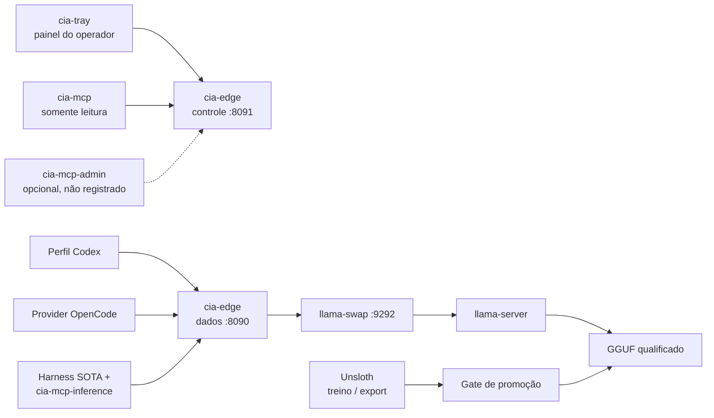

# Local AI Provider

**Português** · **[English](README.en.md)**

**Servidor de inferência compatível com a API da OpenAI, restrito a loopback, que permite rodar agentes de código contra um modelo local — sem que código-fonte, prompts ou credenciais saiam da máquina.**

[](https://go.dev/)
[](LICENSE)
[](#baseline-de-hardware)
[](https://github.com/Sitr3n01/IA_local_server/actions/workflows/ci.yml)
[](#status-do-projeto)

---

## O problema

Harnesses de código como Codex, Claude Code e OpenCode enviam prompts para um provedor na nuvem — e um prompt raramente é só uma pergunta. Ele carrega código-fonte, árvore de arquivos, estrutura de diretórios e schemas de ferramentas.

Apontar esses harnesses para um modelo local parece trivial: basta expor um endpoint compatível com a OpenAI e trocar a base URL. Feito sem cuidado, esse shim reintroduz silenciosamente todos os riscos que deveria eliminar:

- ele **encaminha o token bearer do cliente** para cima, porque proxies copiam headers por padrão;
- ele **cai para a nuvem** quando o modelo local dá erro, e aí falha vira exfiltração sem ninguém perceber;
- ele **loga corpos de request** para depuração, e aí prompts e credenciais vão parar em texto puro no disco;
- ele **escuta em `0.0.0.0`**, e aí qualquer dispositivo da rede alcança a API de inferência.

Este repositório é a versão cuidadosa desse shim. Cada uma dessas quatro falhas é um invariante testado e aplicado aqui — a terceira porque aconteceu de verdade no protótipo v1, e o [incidente está documentado abertamente](incident-reports/2026-07-20-panel-zstd-credential-exposure.md).

## O que é

Um control plane em Go na frente do `llama.cpp`, mais o encanamento de Windows necessário para rodá-lo como um serviço real e supervisionado:

| Responsabilidade | Dono |
|---|---|
| Loop do agente, contexto, execução de ferramentas, retries | **O harness** — nunca este servidor |
| Autenticação/autorização, validação, fila, cancelamento, adaptação de protocolo | `cia-edge` |
| Start preguiçoso do modelo, ciclo de vida de um modelo só, unload por ociosidade | `llama-swap` |
| Geração de tokens | `llama-server` sobre AMD ROCm |
| Guarda de credenciais, contenção de processo, backoff de reinício | `cia-supervisor` + Windows Credential Manager |

O limite de escopo é deliberado e é justamente o ponto: isto é um **plano de inferência e controle de admissão**, não um framework de agente. Não tem histórico de conversa, não tem armazenamento de prompt, não escolhe modelo, e não tem caminho de rede para nenhum provedor de nuvem.

> **Sobre o prefixo `cia-`:** vem da raiz de instalação `C:\IA` (*IA* = *inteligência artificial*). Nenhuma relação com a agência.

## Arquitetura



As requisições entram apenas por loopback. O edge remove o header `Authorization` do cliente, valida o payload contra um contrato específico da rota, injeta uma credencial de router *separada*, e devolve os bytes do upstream de forma incremental com propagação de cancelamento. Rota desconhecida, modelo desconhecido, encoding não suportado ou formato de ferramenta malformado **falham fechado** — não existe segunda opinião para recorrer.

Detalhamento completo: [Arquitetura](docs/ARCHITECTURE.md) · [Threat model](docs/THREAT_MODEL.md) · [Runbook](docs/RUNBOOK.md) · [Tuning](docs/TUNING.md) · [ADRs](docs/adr/)

## Invariantes de segurança

Estes são aplicados em código e verificados por testes, não apenas documentados:

| Invariante | Como é aplicado |
|---|---|
| Todo listener é loopback literal | A config rejeita `0.0.0.0`, `::` e endereços de LAN; a auditoria de instalação inspeciona os listeners ativos |
| Credenciais do cliente nunca chegam ao modelo | O edge remove `Authorization` e cookies; verificado contra um upstream falso em testes de integração |
| Três segredos independentes | Credenciais distintas de inferência / administração / router no Windows Credential Manager |
| Nunca há fallback para nuvem | Nenhum upstream remoto é alcançável; allowlists de rota e modelo; regras de firewall bloqueando saída |
| Logs contêm apenas metadados | ID da requisição, método, rota sanitizada, status, latência. Nunca prompts, corpos, headers ou tokens |
| Descompressão limitada | Teto de 16 MiB na rede / 64 MiB decodificado / expansão 100:1 em identity, gzip e zstd |
| Concorrência limitada | Uma inferência ativa, quatro na fila, limite de espera de 120 s e então `429` com `Retry-After` |
| Acesso direto ao modelo é autenticado | O `llama-server` exige o arquivo de chave do router; inferência sem credencial na porta dinâmica retorna `401` |
| Nenhum segredo em linha de comando | O supervisor injeta em uma allowlist de ambiente local ao processo |
| Nada sensível no Git | A CI rejeita binários e pesos rastreados; o Gitleaks varre o histórico completo |

A separação de privilégio é deliberada em todas as camadas: o control plane é um listener separado do data plane, o MCP administrativo é um **executável separado que nunca é registrado por padrão**, e o painel do operador só lê a credencial de administração numa mutação explícita — seu polling periódico de status é não autenticado e sanitizado, de forma que um impostor em loopback não tem caminho de captura desassistida.

## Componentes

| Executável | Função | Exposição |
|---|---|---|
| `cia-edge` | Data e control plane: auth, validação, fila, streaming | `127.0.0.1:8090` / `:8091` |
| `cia-supervisor` | Contenção em Job Object, backoff exponencial de reinício de 1 a 15 min | Ação de tarefa agendada |
| `cia-tray` | Painel de operador Win32 nativo — status, ciclo de vida, validação de modelo | Área de notificação |
| `cia-credential` | Auxiliar do Windows Credential Manager | Somente processo local |
| `cia-mcp` | MCP operacional somente leitura (5 ferramentas sem efeito colateral) | stdio do harness |
| `cia-mcp-inference` | Uma ferramenta de delegação sem estado, só texto, para harnesses SOTA | stdio do harness |
| `cia-mcp-admin` | MCP de administração de ciclo de vida | **Não registrado por padrão** |
| `cia-manifest` | Validação por JSON Schema do manifesto versionado de modelos | Operador / CI |

## Práticas de engenharia

**Testes.** 103 funções de teste, ~3,5 mil linhas de código de teste contra ~8,7 mil linhas de Go de produção — uma **razão teste/código de ~40%**. A cobertura está concentrada onde importa: manipulação de credenciais, limites de decodificação de corpo, adaptação de protocolo, validação de configuração e caminhos negativos de autorização. Os testes de contrato verificam os invariantes de segurança acima em vez de reafirmar a implementação.

**CI.** Quatro jobs a cada push: parsing de PowerShell e validação de config de harness; formatação/vet/[Staticcheck](https://staticcheck.dev/)/[govulncheck](https://go.dev/blog/govulncheck) de Go com artefato [SBOM CycloneDX](https://cyclonedx.org/); uma execução separada do detector de corrida sobre o núcleo portável; e uma varredura de segredos com [Gitleaks](https://github.com/gitleaks/gitleaks) sobre o histórico completo. Um passo dedicado quebra o build se um `.gguf`, `.safetensors`, `.exe` ou arquivo compactado for rastreado.

**Registros de decisão.** Nove [ADRs](docs/adr/) capturam o *porquê* por trás da arquitetura — a separação de edge fino, a autonomia fail-closed, o gate de manifesto/promoção, painel nativo em vez de UI web, a fronteira de ACL para artefatos externos, e o offload parcial de pesos com cache de contexto em RAM para modelos híbridos.

**Reprodutibilidade.** Módulos diretos e transitivos são pinados, e o `go.mod` fixa um piso de toolchain no nível de patch (`go 1.26.5`) em vez de minor — a CI resolve a versão do Go a partir desse arquivo, então um piso desatualizado significaria compilar e distribuir contra uma biblioteca padrão com advisories conhecidos. O deploy nunca copia do worktree: candidatos a release são compilados numa área de staging, revisados por SHA-256, e então instalados atomicamente num diretório protegido.

**Operações preview-first.** Cada um dos 47 scripts PowerShell de deploy é somente leitura a menos que um switch `-Apply` explícito seja fornecido. Mudanças de firewall e ACL exigem adicionalmente um shell elevado e gravam um registro SDDL de recuperação antes da alteração.

## Gate de promoção de modelo

Modelos não ficam disponíveis só por existirem em disco. Eles percorrem uma máquina de estados explícita:

```text
candidate ──▶ qualified ──▶ enabled ──▶ retired
    ▲             │
    └─────────────┘  regressão exige requalificação
```

`candidate` roda apenas nas portas de canary. Chegar a `qualified` exige hashes SHA-256 imutáveis, registros de licença e proveniência, testes de contrato de protocolo, envelopes medidos de RAM/commit/VRAM, evidência de recuperação de falha e resultados de soak. O gerador de configuração de produção **se recusa a emitir um modelo `candidate`** — ver [Promoção de modelo](docs/MODEL_PROMOTION.md).

## Status do projeto

**Canary v2. A promoção para produção está intencionalmente bloqueada.** O edge em Go, os servidores MCP, o manifesto, o router de ciclo de vida, o auxiliar de credenciais, o supervisor, o painel do operador, os scripts de deploy, os testes e a documentação estão implementados e passando. O que passou na validação de canary: Responses nativo, streaming SSE real, Chat Completions, zstd, function calling, estouro de fila, cancelamento, TTL/unload, descoberta MCP, reinício de router/edge e contenção por Job Object. O overhead p95 do edge foi medido dentro do ruído e abaixo do gate de 50 ms.

Dois gates medidos bloqueiam o cutover, e nenhum dos dois foi contornado com conversa:

1. **Qualificação do modelo.** Uma sessão real do Codex corrigiu um fixture Go e fez `go test ./...` passar — mas o modelo candidato não encerrou a sessão, repetindo turnos de ferramenta até o timeout de cinco minutos.
2. **Envelope de recursos.** A folga de memória comprometida não satisfaz o pico exigido mais a reserva de 4 GiB em contexto de 128k.

O soak de 72 horas / 500 requisições / 20 ciclos não foi executado. Registrar isso no README em vez de publicar assim mesmo *é* a posição de engenharia: um gate de promoção que cede para o próprio autor não é um gate.

## Baseline de hardware

Desenvolvido contra AMD ROCm no Windows. O runtime é pinado pelo SHA-256 medido em vez do rótulo do diretório, porque nomes de arquivo do fornecedor se provaram pouco confiáveis como identidade de versão. Metodologia de benchmark e resultados registrados: [Benchmarks](docs/BENCHMARKS.md).

## Build

```bash
go test -race ./...
go vet ./...
go build -trimpath -o bin/cia-edge.exe ./cmd/cia-edge
go build -trimpath -ldflags="-H=windowsgui" -o bin/cia-tray.exe ./cmd/cia-tray
```

Os binários restantes seguem o mesmo padrão sob `./cmd/`. Essas saídas são descartáveis, de desenvolvimento — o deploy usa o caminho com staging e revisão de hash descrito no [Runbook](docs/RUNBOOK.md).

## Deploy

Os scripts fazem preview por padrão; mutação é sempre uma invocação separada e explícita.

```powershell
# Valida os metadados rastreados de modelo e de harness
.\scripts\v2\Test-V2Manifest.ps1
.\scripts\v2\Test-V2HarnessConfig.ps1

# Inicializa apenas os segredos ausentes; credenciais existentes são preservadas
.\scripts\v2\Initialize-V2Secrets.ps1 -Apply

# Preview e então geração do deploy de canary
.\scripts\v2\New-V2Config.ps1 -Environment Canary
.\scripts\v2\New-V2Config.ps1 -Environment Canary -Apply
```

Os templates de integração de harness ficam em [`integrations/`](integrations/) e não contêm segredos. O Codex mantém seu login normal da OpenAI intocado — o acesso local é um perfil selecionado explicitamente, com endpoint e modelo pinados na precedência de CLI, de modo que uma configuração no nível do repositório não consiga redirecionar silenciosamente uma sessão que o usuário pediu para manter local.

## Mapa do repositório

```
cmd/                 9 binários Go (edge, supervisor, tray, servidores MCP, ferramental)
internal/            edge, credential, panel, supervisor, MCP, trayui, rotatelog
config/              manifesto versionado de modelos + JSON Schema (fonte da verdade)
scripts/v2/          47 scripts PowerShell de deploy, preview-first
integrations/        templates de perfil para Codex e OpenCode (sem segredos)
docs/                arquitetura, threat model, runbook, benchmarks, promoção, tuning, 9 ADRs
incident-reports/    registro sanitizado da exposição de credencial da v1
benchmarks/          evidência registrada de benchmark de modelos
control/             painel Python legado da v1 — apenas evidência de migração, nunca alvo de rollback
```

## Documentação

A documentação longa é escrita em inglês.

| Documento | Conteúdo |
|---|---|
| [Arquitetura](docs/ARCHITECTURE.md) | Contratos de componente, máquina de estados, comportamento em falha, 10 invariantes |
| [Threat model](docs/THREAT_MODEL.md) | Ativos, 7 fronteiras de confiança, matriz ameaça/controle/verificação, riscos residuais |
| [Runbook](docs/RUNBOOK.md) | Procedimentos operacionais e fronteiras de rollback |
| [Promoção de modelo](docs/MODEL_PROMOTION.md) | Critérios de qualificação e aplicação do gate |
| [Benchmarks](docs/BENCHMARKS.md) | Metodologia de medição e formato de evidência |
| [Tuning](docs/TUNING.md) | Diagnóstico de gargalo e teto de banda de memória |
| [ADRs](docs/adr/) | Nove registros de decisão arquitetural |
| [Política de segurança](SECURITY.md) | Processo de reporte |

## Licença

O código-fonte é [Apache-2.0](LICENSE). Licenças e hashes de terceiros estão registrados no [NOTICE](NOTICE) e no manifesto de modelos. Nenhum peso de modelo ou executável de runtime é redistribuído.
