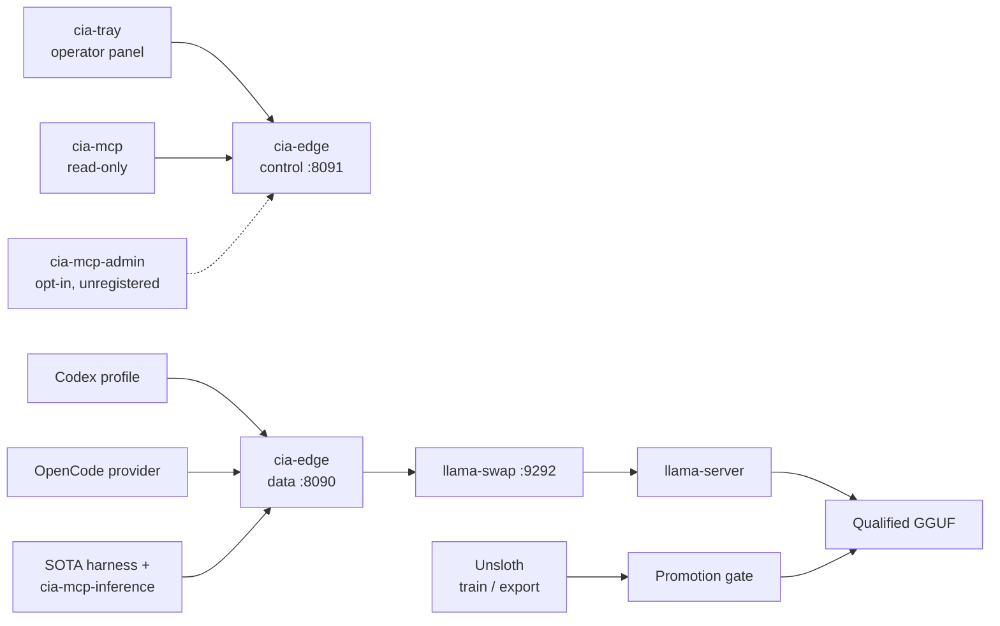

# Local AI Provider

**A loopback-only, OpenAI-compatible inference server that lets coding agents run against a local model — without source code, prompts, or credentials ever leaving the machine.**

[](https://go.dev/)
[](LICENSE)
[](#hardware-baseline)
[](https://github.com/Sitr3n01/IA_local_server/actions/workflows/ci.yml)
[](#project-status)

---

## The problem

Coding harnesses like Codex, Claude Code, and OpenCode send prompts to a cloud provider — and a prompt is rarely just a question. It carries source code, file trees, directory structure, and tool schemas.

Pointing those harnesses at a local model looks trivial: expose an OpenAI-compatible endpoint and change the base URL. Done badly, that shim quietly reintroduces every risk it was meant to remove:

- it **forwards the client's bearer token** upstream, because proxies copy headers by default;
- it **falls back to the cloud** when the local model errors, so failure silently becomes exfiltration;
- it **logs request bodies** for debugging, so prompts and credentials land in plaintext on disk;
- it **binds to `0.0.0.0`**, so every device on the network can reach the inference API.

This repository is the careful version of that shim. Each of those four failures is a tested, enforced invariant here — the third one because it actually happened to the v1 prototype, and the [incident is documented in the open](incident-reports/2026-07-20-panel-zstd-credential-exposure.md).

## What it is

A Go control plane in front of `llama.cpp`, plus the Windows plumbing needed to run it as a real, supervised service:

| Concern | Owner |
|---|---|
| Agent loop, context, tool execution, retries | **The harness** — never this server |
| AuthN/Z, validation, queueing, cancellation, protocol adaptation | `cia-edge` |
| Lazy model start, one-model lifecycle, idle unload | `llama-swap` |
| Token generation | `llama-server` on AMD ROCm |
| Credential storage, process containment, restart backoff | `cia-supervisor` + Windows Credential Manager |

The deliberate scope limit is the point: this is an **inference and admission-control plane**, not an agent framework. It has no conversation history, no prompt store, no model chooser, and no network path to any cloud provider.

> **On the `cia-` prefix:** it stands for the install root `C:\IA` (*IA* = *inteligência artificial*). No relation to the agency.

## Architecture



Requests enter on loopback only. The edge strips the client's `Authorization` header, validates the payload against a route-specific contract, injects a *separate* router credential, and streams upstream bytes back incrementally with cancellation propagation. An unknown route, unknown model, unsupported encoding, or malformed tool shape **fails closed** — there is no second opinion to fall back to.

Full detail: [Architecture](docs/ARCHITECTURE.md) · [Threat model](docs/THREAT_MODEL.md) · [Runbook](docs/RUNBOOK.md) · [ADRs](docs/adr/)

## Security invariants

These are enforced in code and asserted by tests, not just documented:

| Invariant | How it is enforced |
|---|---|
| Every listener is literal loopback | Config rejects `0.0.0.0`, `::`, and LAN addresses; installation audit inspects live listeners |
| Client credentials never reach the model | Edge removes `Authorization` and cookies; verified against a fake upstream in integration tests |
| Three independent secrets | Distinct inference / admin / router credentials in Windows Credential Manager |
| No cloud fallback, ever | No remote upstream is reachable; route + model allowlists; outbound firewall deny rules |
| Logs are metadata-only | Request ID, method, sanitized route, status, latency. Never prompts, bodies, headers, or tokens |
| Bounded decompression | 16 MiB wire / 64 MiB decoded / 100:1 expansion ceiling on identity, gzip, and zstd |
| Bounded concurrency | One active inference, four queued, 120 s wait limit, then `429` with `Retry-After` |
| Direct model access is authenticated | `llama-server` requires the router key file; unauthenticated inference on the dynamic port returns `401` |
| No secrets on command lines | Supervisor injects into a process-local environment allowlist |
| Nothing sensitive in Git | CI rejects tracked binaries and weights; Gitleaks scans full history |

The privilege split is deliberate at every layer: the control plane is a separate listener from the data plane, the administrative MCP is a **separate executable that is never registered by default**, and the operator panel reads the admin credential only on an explicit mutation — its periodic status poll is unauthenticated and sanitized, so a loopback impostor has no unattended capture path.

## Components

| Executable | Purpose | Exposure |
|---|---|---|
| `cia-edge` | Data + control plane: auth, validation, queue, streaming | `127.0.0.1:8090` / `:8091` |
| `cia-supervisor` | Job Object containment, 1–15 min exponential restart backoff | Scheduled-task action |
| `cia-tray` | Native Win32 operator panel — status, lifecycle, model validation | Notification area |
| `cia-credential` | Windows Credential Manager helper | Local process only |
| `cia-mcp` | Read-only operational MCP (5 side-effect-free tools) | Harness stdio |
| `cia-mcp-inference` | One stateless, text-only delegation tool for SOTA harnesses | Harness stdio |
| `cia-mcp-admin` | Lifecycle administration MCP | **Not registered by default** |
| `cia-manifest` | JSON Schema validation of the versioned model manifest | Operator / CI |

## Engineering practices

**Testing.** 103 test functions, ~3.5k lines of test code against ~8.7k lines of production Go — a **~40% test-to-source ratio**. Coverage is concentrated where it matters: credential handling, body decoding limits, protocol adaptation, config validation, and negative authorization paths. Contract tests assert the security invariants above rather than restating implementation.

**CI.** Four jobs on every push: PowerShell parse + harness-config validation, Go format/vet/[Staticcheck](https://staticcheck.dev/)/[govulncheck](https://go.dev/blog/govulncheck) with a [CycloneDX SBOM](https://cyclonedx.org/) artifact, a separate race-detector run on the portable core, and a full-history [Gitleaks](https://github.com/gitleaks/gitleaks) secret scan. A dedicated step fails the build if a `.gguf`, `.safetensors`, `.exe`, or archive is ever tracked.

**Decision records.** Eight [ADRs](docs/adr/) capture the *why* behind the architecture — the thin-edge split, fail-closed autonomy, the manifest/promotion gate, native panel over web UI, and the external-artifact ACL boundary.

**Reproducibility.** Go 1.26 with direct and transitive modules pinned. Deployment never copies from the worktree: release candidates build into a staging area, are reviewed by SHA-256, then install atomically into a protected directory.

**Preview-first operations.** Every one of the 47 PowerShell deployment scripts is read-only unless an explicit `-Apply` switch is supplied. Firewall and ACL changes additionally require an elevated shell and write a pre-change SDDL recovery record.

## Model promotion gate

Models do not become available by existing on disk. They move through an explicit state machine:

```text
candidate ──▶ qualified ──▶ enabled ──▶ retired
    ▲             │
    └─────────────┘  regression requires requalification
```

`candidate` runs only on canary ports. Reaching `qualified` requires immutable SHA-256 hashes, license and provenance records, protocol contract tests, measured RAM/commit/VRAM envelopes, failure-recovery evidence, and soak results. The production config generator **refuses to emit a `candidate` model** — see [Model promotion](docs/MODEL_PROMOTION.md).

## Project status

**v2 canary. Production promotion is intentionally blocked.** The Go edge, MCP servers, manifest, lifecycle router, credential helper, supervisor, operator panel, deployment scripts, tests, and documentation are implemented and passing. What passed canary validation: native Responses, true SSE streaming, Chat Completions, zstd, function calling, queue overflow, cancellation, TTL/unload, MCP discovery, router/edge restart, and Job Object containment. Edge p95 overhead measured within noise and below the 50 ms gate.

Two measured gates block cutover, and neither is hand-waved:

1. **Model qualification.** A real Codex session fixed a Go fixture and made `go test ./...` pass — but the candidate model failed to terminate the session, repeating tool turns until the five-minute timeout.
2. **Resource envelope.** Committed-memory headroom does not satisfy the required peak plus a 4 GiB reserve at 128k context.

The 72-hour / 500-request / 20-cycle soak has not been run. Recording this in the README rather than shipping anyway *is* the engineering position: a promotion gate that bends for its own author is not a gate.

## Hardware baseline

Developed against AMD ROCm on Windows. The runtime is pinned by measured SHA-256 rather than by its directory label, because vendor archive names have proven unreliable as version identity. Benchmark methodology and recorded results: [Benchmarks](docs/BENCHMARKS.md).

## Build

```bash
go test -race ./...
go vet ./...
go build -trimpath -o bin/cia-edge.exe ./cmd/cia-edge
go build -trimpath -ldflags="-H=windowsgui" -o bin/cia-tray.exe ./cmd/cia-tray
```

Remaining binaries follow the same pattern under `./cmd/`. These are disposable developer outputs — deployment uses the staged, hash-reviewed path described in the [Runbook](docs/RUNBOOK.md).

## Deployment

Scripts preview by default; mutation is always a separate, explicit invocation.

```powershell
# Validate tracked model and harness metadata
.\scripts\v2\Test-V2Manifest.ps1
.\scripts\v2\Test-V2HarnessConfig.ps1

# Initialize only missing secrets; existing credentials are preserved
.\scripts\v2\Initialize-V2Secrets.ps1 -Apply

# Preview, then generate the canary deployment
.\scripts\v2\New-V2Config.ps1 -Environment Canary
.\scripts\v2\New-V2Config.ps1 -Environment Canary -Apply
```

Harness integration templates live under [`integrations/`](integrations/) and contain no secrets. Codex keeps its normal OpenAI login untouched — local access is an explicitly selected profile, with endpoint and model pinned at CLI precedence so a repository-level config cannot silently redirect a session that the user asked to keep local.

## Repository map

```
cmd/                 9 Go binaries (edge, supervisor, tray, MCP servers, tooling)
internal/            edge, credential, panel, supervisor, MCP, trayui, rotatelog
config/              versioned model manifest + JSON Schema (source of truth)
scripts/v2/          47 preview-first PowerShell deployment scripts
integrations/        Codex and OpenCode profile templates (secret-free)
docs/                architecture, threat model, runbook, benchmarks, promotion, 8 ADRs
incident-reports/    sanitized v1 credential-exposure record
benchmarks/          recorded model benchmark evidence
control/             legacy v1 Python panel — migration evidence only, never a rollback target
```

## Documentation

| Document | Contents |
|---|---|
| [Architecture](docs/ARCHITECTURE.md) | Component contracts, state machine, failure behavior, 10 invariants |
| [Threat model](docs/THREAT_MODEL.md) | Assets, 7 trust boundaries, threat/control/verification matrix, residual risks |
| [Runbook](docs/RUNBOOK.md) | Operational procedures and rollback boundaries |
| [Model promotion](docs/MODEL_PROMOTION.md) | Qualification criteria and gate enforcement |
| [Benchmarks](docs/BENCHMARKS.md) | Measurement methodology and evidence format |
| [ADRs](docs/adr/) | Eight architecture decision records |
| [Security policy](SECURITY.md) | Reporting process |

## License

Source code is [Apache-2.0](LICENSE). Third-party licenses and hashes are recorded in [NOTICE](NOTICE) and the model manifest. No model weights or runtime executables are redistributed.
