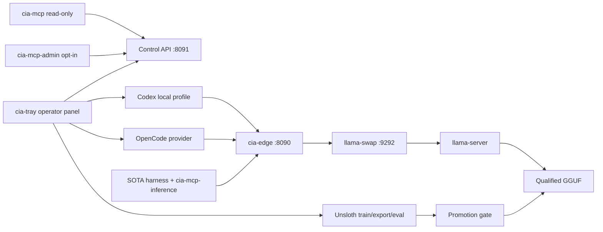

# CIA Local AI Provider

A local-only, OpenAI-compatible inference provider for Codex, OpenCode, and other coding harnesses on Windows/AMD hardware.

The project keeps the agent loop inside each harness and limits the backend to inference, lifecycle, admission control, observability, and explicit administration. It never falls back to a cloud model or silently substitutes a weaker local model.

> Status: v2 canary. The Go edge, MCP servers, model manifest, lifecycle router, credential helper, deployment scripts, tests, and documentation are implemented. Production promotion remains intentionally blocked until the hardware qualification and soak gates pass.

## Architecture



- `cia-edge` exposes only `/v1/models`, `/v1/responses`, and `/v1/chat/completions` on a literal loopback address.
- `llama-swap` owns lazy loading, unload TTL, and the catalog lifecycle while
  enforcing at most one loaded model.
- `cia-mcp` exposes five side-effect-free health and observability tools.
- `cia-mcp-inference` exposes one stateless, text-only delegation tool. Its
  server instructions require an explicit user request to consult the local
  model; the SOTA harness remains the agent and tool orchestrator.
- `cia-mcp-admin` is a separate executable and is never registered by default.
- `cia-credential` stores three independent secrets in Windows Credential Manager.
- `cia-supervisor` injects process-local credentials and contains each serving tree in a Windows Job Object with bounded restart backoff.
- `cia-tray` is a native Windows notification-area controller for status, explicit lifecycle operations, model preference, and safe harness launchers.
- `config/models.yaml` is the versioned source of truth for model, runtime, provenance, capability, and resource qualification.

See [Architecture](docs/ARCHITECTURE.md), [Threat model](docs/THREAT_MODEL.md), and the [Runbook](docs/RUNBOOK.md).

## Security invariants

- Literal loopback listeners only; no LAN bind.
- Distinct inference, administration, and router credentials.
- Client authorization and cookies are stripped before proxying.
- Identity, gzip, and zstd request bodies are bounded before and after decompression.
- One active inference and a bounded four-request queue.
- Unknown route or model fails locally; there is no Internet fallback.
- Streaming is passed through incrementally and client cancellation propagates upstream.
- Logs contain request metadata only, never prompts, responses, headers, cookies, or tokens.
- Model weights, runtime binaries, generated configs, and secrets are not tracked by Git.

The legacy Python panel and its MCP bridge remain only as migration evidence. They are not safe production or rollback surfaces.

## Components

| Executable | Purpose | Default exposure |
|---|---|---|
| `cia-edge.exe` | Data plane, control plane, validation, queue, streaming | `127.0.0.1:8090` and `:8091` |
| `cia-mcp.exe` | Read-only operational MCP over stdio | Spawned by a harness |
| `cia-mcp-inference.exe` | Explicit, stateless delegation to the pinned local model | Spawned by SOTA harnesses |
| `cia-mcp-admin.exe` | Explicit lifecycle administration MCP | Not registered |
| `cia-credential.exe` | Windows Credential Manager helper and OpenCode launcher | Local process only |
| `cia-supervisor.exe` | Job Object containment and 1-15 minute crash backoff | Scheduled-task action |
| `cia-manifest.exe` | JSON Schema validation for the versioned model manifest | Local operator/CI |
| `cia-tray.exe` | Native operator panel; no chat or conversation state | Windows notification area |
| `llama-swap.exe` | Pinned upstream model lifecycle router | Internal `127.0.0.1:9292` |

## Reproducible build

The repository targets Go 1.26 and pins direct and transitive modules in `go.mod`/`go.sum`.

```powershell
go test -race ./...
go vet ./...
go build -trimpath -o bin/cia-edge.exe ./cmd/cia-edge
go build -trimpath -o bin/cia-mcp.exe ./cmd/cia-mcp
go build -trimpath -o bin/cia-mcp-inference.exe ./cmd/cia-mcp-inference
go build -trimpath -o bin/cia-mcp-admin.exe ./cmd/cia-mcp-admin
go build -trimpath -o bin/cia-credential.exe ./cmd/cia-credential
go build -trimpath -o bin/cia-supervisor.exe ./cmd/cia-supervisor
go build -trimpath -o bin/cia-manifest.exe ./cmd/cia-manifest
go build -trimpath -ldflags="-H=windowsgui" -o bin/cia-tray.exe ./cmd/cia-tray
```

Those paths are disposable developer outputs. Deployment never copies directly
from the worktree: Edge, MCP, and tray release candidates are built into the
writable `C:\IA\local-ai-v2\state\staging` area (including the separately
disabled admin MCP), reviewed by SHA-256, and then
atomically installed into the protected `bin` directory with the scripts in
the runbook.

CI also runs the race detector on the portable core, Staticcheck,
govulncheck, Gitleaks, PowerShell parsing, manifest validation,
binary/weight rejection, and CycloneDX SBOM generation. Windows-specific
Win32 code is compiled and tested on the Windows job; the local toolchain has
no C compiler, so `-race` is not claimed for the tray message loop.
It also validates both harness profiles, their endpoint/model pins, command-backed
authentication, and the exact read-only MCP allowlist.

## Canary deployment

Scripts are preview-only unless the explicit mutation switch is supplied.

```powershell
# Validate tracked model/runtime metadata.
.\scripts\v2\Test-V2Manifest.ps1
.\scripts\v2\Test-V2HarnessConfig.ps1

# Initialize only missing secrets; existing credentials are preserved.
.\scripts\v2\Initialize-V2Secrets.ps1 -Apply

# Preview, then generate the canary deployment on 18090/18091 -> 19292.
.\scripts\v2\New-V2Config.ps1 -Environment Canary
.\scripts\v2\New-V2Config.ps1 -Environment Canary -Apply

# Preview scheduled tasks. Registration is separately explicit.
.\scripts\v2\Install-V2ScheduledTasks.ps1 -Environment Canary
```

Generation also creates `panel.canary.json` and a hidden manual tray launcher.
After the manual panel smoke test passes, the separate
`Install-V2PanelStartup.ps1` script can add an idempotent current-user Startup
shortcut. Router and Edge remain the only two scheduled tasks.

The production generator rejects `candidate` models. Promotion requires immutable hashes, license/provenance, protocol contracts, tool correctness, measured RAM/commit/VRAM, failure recovery, performance comparison, and the soak criteria in [Model promotion](docs/MODEL_PROMOTION.md).

## Harness integration

Templates live under `integrations/` and contain no secrets.
Their structure follows the official [Codex advanced configuration](https://developers.openai.com/codex/config-advanced),
[OpenCode provider](https://opencode.ai/docs/providers/),
[OpenCode configuration precedence](https://opencode.ai/docs/config/), and
[OpenCode MCP](https://opencode.ai/docs/mcp-servers/) contracts.

### Codex

- Base OpenAI configuration and login remain unchanged.
- The final local provider is an explicit `cia-local` profile using native Responses.
- Canary validation uses the separate `cia-local-canary` profile on data
  `18090` and control `18091`; it does not reuse the final/v1 ports.
- Authentication comes from `cia-credential get inference`.
- Request compression is disabled in the profile as defense in depth; the edge still supports zstd.
- Only the read-only MCP server is registered.

Install and run the canary explicitly while production promotion is blocked.
The launchers accept only an exact model ID already present in their generated
local-only catalogs:

```powershell
$codexHome = 'C:\Users\Sitr3n\.codex'
.\scripts\v2\Install-V2Harness.ps1 -Environment Canary -TargetCodexHome $codexHome
# Copy the reviewed plan_sha256 into the next command; do not calculate it inline.
.\scripts\v2\Install-V2Harness.ps1 -Environment Canary -TargetCodexHome $codexHome -ExpectedPlanSha256 '<reviewed plan_sha256>' -Apply
.\integrations\codex\Start-CodexLocalCanary.ps1
```

The local-provider installer does not modify the normal `codex` command or
`~/.codex/config.toml`.

### SOTA model with explicit local delegation

`cia-mcp-inference.exe` lets the normal Codex, Claude, or OpenCode model remain
the primary SOTA model while delegating one bounded text task to
`local-coding`. The only tool is `local_ai_delegate`; it has no filesystem,
shell, network, model-selection, history, or administrative capability. The
caller supplies the minimum prompt and optional reference text, and the local
answer is returned as structured MCP output.

The client integration is global but does not change any provider, model,
login, or cloud default. The tool and server instructions both say to invoke it
only when the user explicitly asks to use the local model or local AI server.
The binary obtains the inference credential directly from Windows Credential
Manager after validating the request; no secret is stored in client config or
passed on a command line.

The metadata-only live probe performs a real MCP stdio handshake and a real
generation without printing the delegated prompt or response:

```powershell
go run .\cmd\cia-mcp-smoke -expected CIA_LOCAL_MCP_SMOKE_OK
```

### OpenCode

- Provider ID: `cia-local`
- AI SDK adapter: `@ai-sdk/openai-compatible`
- Explicit model: `cia-local/local-coding`
- API key exists only in the launched process environment.

During canary validation, the isolated provider ID is `cia-local-canary`, its
config is supplied only to the launched process, and the launcher pins
`cia-local-canary/local-coding`. It does not write an OpenCode global or project
config.

```powershell
.\integrations\opencode\Start-OpenCodeLocalCanary.ps1
```

### Unsloth boundary

Unsloth remains installed as an offline training/export/evaluation environment,
but v2 does not display, launch, configure, or stop it. Its scripts, private
state, models, and candidate runtime remain untouched and available for manual
use outside CIA Local AI. Legacy Unsloth Startup shortcuts stay disabled.

## Windows operator panel

`cia-tray.exe` deliberately separates three states:

- **available** comes from the installed manifest intersected with the edge allowlist;
- **selected** is only the default for new sessions and is stored atomically under `state`;
- **loaded** is live router state and may be empty while lazy loading is idle.

Double-click the generated tray icon to open the native dashboard. It provides
search, model details, load/unload/switch/validation controls, sanitized
activity, model-folder management, and allowlisted Codex/OpenCode launchers.
Closing the window returns it to the tray. Discovered GGUFs remain visible while
validation or capability gates are pending, and existing harness sessions are
never rewritten.

Validation records the resolved file, SHA-256, and timestamp under protected
state. Hashes are cached by path, size, and nanosecond modification time.
Unregistered GGUFs receive a header/hash inspection first and remain blocked
until a reviewed manifest execution profile permits isolated load/generation.

Once the icon and actions have been checked manually, preview and install its
current-user logon shortcut:

```powershell
.\scripts\v2\Install-V2PanelStartup.ps1
.\scripts\v2\Install-V2PanelStartup.ps1 -Apply
```

## Operations

- Health: `GET http://127.0.0.1:8091/livez`
- Readiness: `GET http://127.0.0.1:8091/readyz`
- Sanitized read-only status: `GET http://127.0.0.1:8091/api/v1/status` (no credential)
- Prometheus metrics: `GET http://127.0.0.1:8091/metrics` (admin credential)
- Stable model ID: `local-coding`
- Idle unload: 900 seconds
- Active/queued requests: 1/4
- Queue wait limit: 120 seconds

Operational procedures and rollback boundaries are defined in the [Runbook](docs/RUNBOOK.md). Benchmark and soak evidence belongs in the format described by [Benchmarks](docs/BENCHMARKS.md).

## Unsloth boundary

Unsloth is a training, quantization, export, and evaluation tool. It is not the production supervisor or provider source of truth. An exported GGUF is invisible to clients until it passes the promotion workflow and is represented by a qualified manifest entry.

## Repository policy

- Source code: Apache-2.0.
- Third-party licenses and hashes: `NOTICE`, the manifest, and the installed `third_party` directory.
- No model weights or runtime executables are redistributed.
- No public remote or release is created automatically.

Security reports must follow [SECURITY.md](SECURITY.md); never attach raw panel, Unsloth, request, or credential logs.
