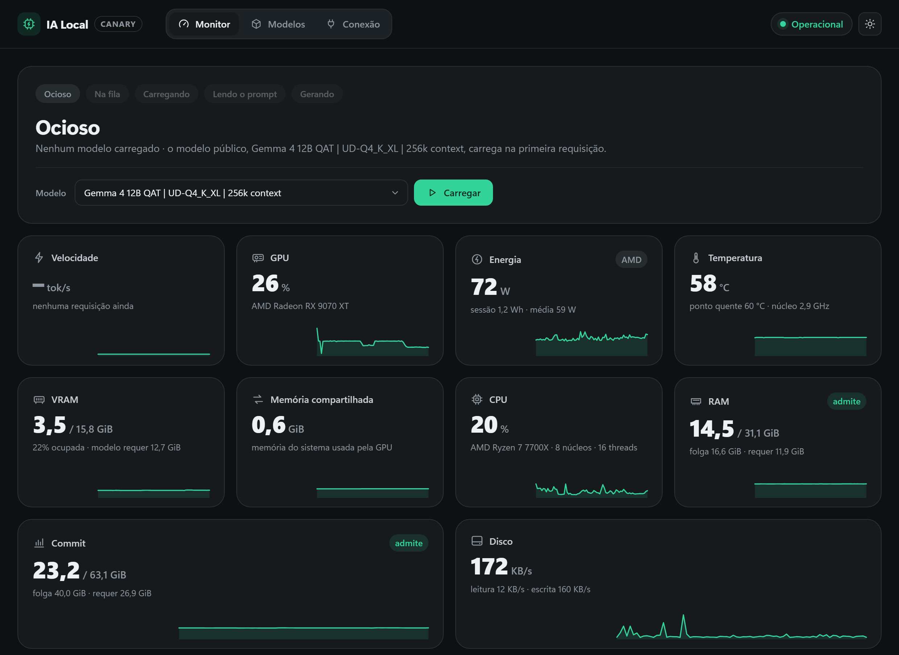
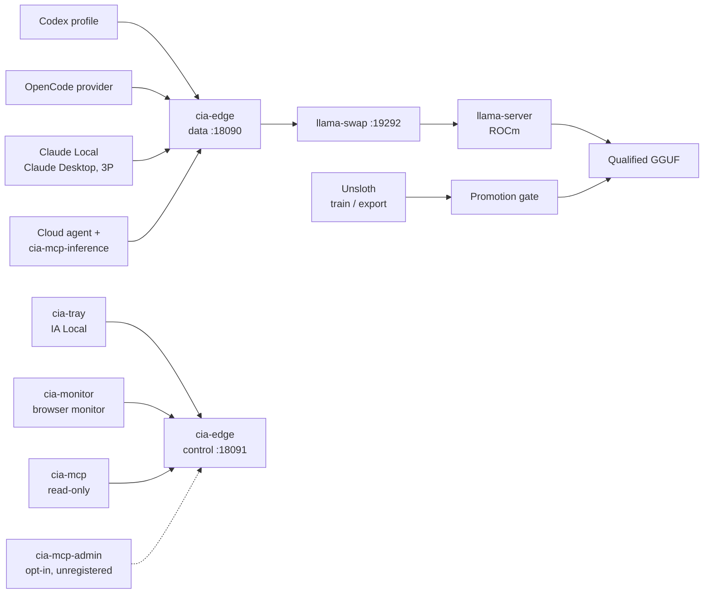
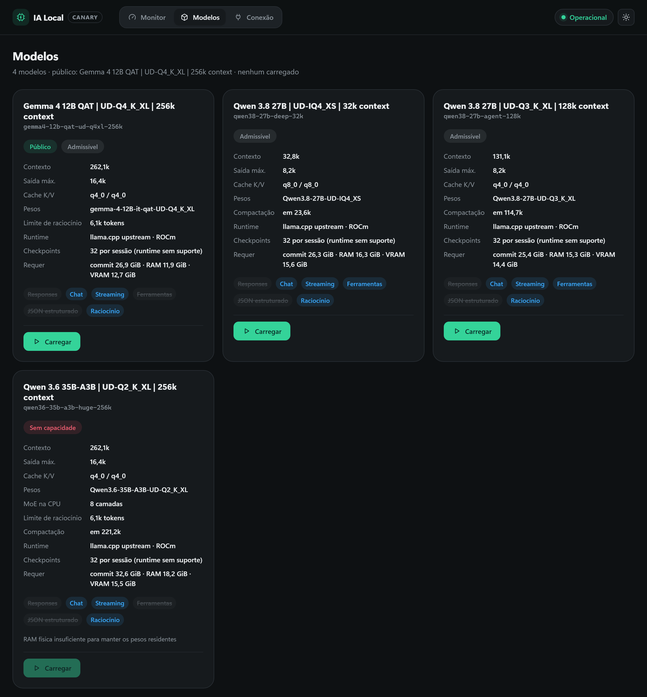

# Local AI Provider

**English** · **[Português (Brasil)](README.pt-BR.md)**

**A loopback-only, OpenAI-compatible inference server that lets coding agents run against a local model — without source code, prompts, or credentials ever leaving the machine.**

[](https://github.com/Sitr3n01/local-ai-provider/actions/workflows/ci.yml)
[](https://github.com/Sitr3n01/local-ai-provider/actions/workflows/codeql.yml)
[](https://github.com/Sitr3n01/local-ai-provider/releases)
[](go.mod)
[](LICENSE)
[](#hardware-baseline)

<p align="center">
  
  <br>
  <sub>The browser monitor on the live canary, idle. The <i>admite</i> badges show whether the selected model fits in RAM and commit right now. The UI is in Portuguese.</sub>
</p>

## The problem

Coding harnesses like Codex, Claude Code, and OpenCode send prompts to a cloud provider — and a prompt is rarely just a question. It carries source code, file trees, directory structure, and tool schemas.

Pointing those harnesses at a local model looks trivial: expose an OpenAI-compatible endpoint and change the base URL. Done badly, that shim quietly reintroduces every risk it was meant to remove:

- it **forwards the client's bearer token** upstream, because proxies copy headers by default;
- it **falls back to the cloud** when the local model errors, so failure silently becomes exfiltration;
- it **logs request bodies** for debugging, so prompts and credentials land in plaintext on disk;
- it **binds to `0.0.0.0`**, so every device on the network can reach the inference API.

This repository is the careful version of that shim. Each of those four failures is a tested, enforced invariant here — the third one because it actually happened to the v1 prototype, and the [incident is documented in the open](incident-reports/2026-07-20-panel-zstd-credential-exposure.md).

## What it is

A Go control plane in front of `llama.cpp`, plus the Windows plumbing needed to run it as a real, supervised service:

| Concern | Owner |
|---|---|
| Agent loop, context, tool execution, retries | **The harness** — never this server |
| AuthN/Z, validation, queueing, cancellation, protocol adaptation | `cia-edge` |
| Lazy model start, one-model lifecycle, idle unload | `llama-swap` |
| Token generation | `llama-server` on AMD ROCm |
| Credential storage, process containment, restart backoff | `cia-supervisor` + Windows Credential Manager |

The deliberate scope limit is the point: this is an **inference and admission-control plane**, not an agent framework. It has no conversation history, no prompt store, no model chooser, and no network path to any cloud provider.

> **Names.** The project is *Local AI Provider*. Its Windows tray app is called *IA Local*, and every executable carries the `cia-` prefix, from the install root `C:\IA` (*IA* is Portuguese for *AI*). No relation to the agency.

## Results at a glance

Measured on the [hardware below](#hardware-baseline). Every row links to the versioned evidence it comes from.

| Measure | Result | Evidence |
|---|---|---|
| Edge overhead | p95 of **18.2 ms** over 30 short, warm request pairs, against a 50 ms gate; throughput difference −0.085%, within noise | [Readiness review](docs/reports/2026-10-01-deploy-readiness.md#evidence-completed-in-this-review) |
| Long-context recall, Qwen3.6 35B-A3B | **120/120** planted-fact checks across ten fill levels, up to 240k tokens | [Final roster §C](docs/reports/FINAL-ROSTER-20260825.md#c-retention) |
| Long-context recall, Gemma 4 12B | **59/60** up to 240k tokens in its 256k window | [Final roster](docs/reports/FINAL-ROSTER-20260825.md#retention-up-the-ramp) |
| Decode with the context filled, Qwen3.6 35B-A3B | **50.4 tok/s** at 120k tokens, **32.9 tok/s** at 240k | [Final roster §D](docs/reports/FINAL-ROSTER-20260825.md#d-performance-with-the-context-filled) |
| Real agent session | Codex on the Agent profile ran a failing Go test, fixed the code and got the suite passing in **114 s**, original tests untouched | [Readiness review](docs/reports/2026-10-01-deploy-readiness.md#real-model-contracts) |
| Protocol contracts | **27** (Deep) and **28** (Agent) checks passed: native Responses, namespaced tools, SSE, cancellation, recovery | [Readiness review](docs/reports/2026-10-01-deploy-readiness.md#real-model-contracts) |
| Test suite | **728** Go tests and subtests on Windows; **653** under `-race` on Linux (2026-10-01) | [Readiness review](docs/reports/2026-10-01-deploy-readiness.md#evidence-completed-in-this-review) |
| Reproducible builds | Edge and administrative MCP rebuilt with identical SHA-256 | [Readiness review](docs/reports/2026-10-01-deploy-readiness.md#evidence-completed-in-this-review) |

## Architecture


```mermaid
flowchart LR
    C["Codex profile"] --> E
    O["OpenCode provider"] --> E
    K["Claude Local<br/>Claude Desktop, 3P"] --> E
    D["Cloud agent +<br/>cia-mcp-inference"] --> E
    E["cia-edge<br/>data :18090"] --> S
    S["llama-swap :19292"] --> L["llama-server<br/>ROCm"]
    L --> G["Qualified GGUF"]
    T["cia-tray<br/>IA Local"] --> P
    W["cia-monitor<br/>browser monitor"] --> P
    M["cia-mcp<br/>read-only"] --> P
    A["cia-mcp-admin<br/>opt-in, unregistered"] -.-> P
    P["cia-edge<br/>control :18091"]
    U["Unsloth<br/>train / export"] --> Q["Promotion gate"]
    Q --> G
```

Ports are the canary deployment's; the final deployment uses `8090`, `8091` and `9292`. Requests enter on loopback only. The edge strips the client's `Authorization` header, validates the payload against a route-specific contract, injects a *separate* router credential, and streams upstream bytes back incrementally with cancellation propagation. An unknown route, unknown model, unsupported encoding, or malformed tool shape **fails closed** — there is no second opinion to fall back to.

Full detail: [Architecture](docs/ARCHITECTURE.md) · [Threat model](docs/THREAT_MODEL.md) · [Runbook](docs/RUNBOOK.md) · [Tuning](docs/TUNING.md) · [ADRs](docs/adr/README.md)

## Security invariants

These are enforced in code and asserted by tests, not just documented:

| Invariant | How it is enforced |
|---|---|
| Every listener is literal loopback | Config rejects `0.0.0.0`, `::`, and LAN addresses; installation audit inspects live listeners |
| Client credentials never reach the model | Edge removes `Authorization` and cookies; verified against a fake upstream in integration tests |
| Three independent secrets | Distinct inference / admin / router credentials in Windows Credential Manager |
| No cloud fallback, ever | No remote upstream is reachable; route + model allowlists; outbound firewall deny rules |
| Logs are metadata-only | Request ID, method, sanitized route, status, latency. Never prompts, bodies, headers, or tokens |
| Bounded decompression | 16 MiB wire / 64 MiB decoded / 100:1 expansion ceiling on identity, gzip, and zstd |
| Bounded concurrency | Defaults: one active inference, up to 16 queued, and a 120 s wait; overflow or timeout returns `429` with `Retry-After`. Bounded body reading happens before the wait and has its own concurrency limit |
| Direct model access is authenticated | `llama-server` requires the router key file; unauthenticated inference on the dynamic port returns `401` |
| No secrets on command lines | Supervisor injects into a process-local environment allowlist |
| Nothing sensitive in Git | CI rejects tracked binaries and weights; Gitleaks scans full history |

The privilege split is deliberate at every layer: the control plane is a separate listener from the data plane, the administrative MCP is a **separate executable that is never registered by default**, and the tray reads the admin credential only on an explicit mutation — its periodic status poll is unauthenticated and sanitized, so a loopback impostor has no unattended capture path.

## Components

| Executable | Purpose | Exposure |
|---|---|---|
| `cia-edge` | Data + control plane: auth, validation, queue, streaming | `127.0.0.1:18090` / `:18091` (canary); `:8090` / `:8091` (final) |
| `cia-supervisor` | Job Object containment, 1–15 min exponential restart backoff | Scheduled-task action |
| `cia-tray` | IA Local: native icon and flyout in the monitor's design — starts and stops the server, status, load/switch/unload, opens the monitor and the clients | Notification area; the only startup entry |
| `cia-monitor` | Browser monitor — request phase, tokens/s, GPU, RAM, commit; load/unload a model behind a native confirmation | `127.0.0.1:18095` (canary) / `:8095` (final) |
| `cia-credential` | Windows Credential Manager helper | Local process only |
| `cia-mcp` | Read-only operational MCP (5 side-effect-free tools) | Harness stdio |
| `cia-mcp-inference` | One stateless, text-only tool a cloud coding agent can use to hand a subtask to the local model | Harness stdio |
| `cia-mcp-admin` | Lifecycle administration MCP | **Not registered by default** |
| `cia-mcp-smoke` | Live probe of the installed `cia-mcp-inference`: MCP handshake, single-tool surface, exact synthetic marker; metadata-only report | Operator; launches the MCP server as a stdio child |
| `cia-manifest` | JSON Schema validation of the versioned model manifest | Operator / CI |
| `cia-fork-gate` | Provenance gate: decides whether a pinned `buun-llama-cpp` commit may be built and adopted as the Qwen3.8 agentic runtime; never loads a model, opens a port, or reaches the network | Operator, via `Build-V2ForkRuntime.ps1` |

## Model roster

Four models, four jobs. A client selects one by model id; switching is a model swap in llama-swap, not a reconfiguration. All four are `candidate` on the canary deployment — see [Project status](#project-status).

| Model id | Weights | KV cache | Context | Max output | Job |
|---|---|---|---:|---:|---|
| `gemma4-12b-qat-ud-q4xl-256k` | Gemma 4 12B QAT UD-Q4_K_XL | `q4_0`/`q4_0` | 256k | 8k | **Public model**: plain inference and the stateless delegation tool. No qualified tools |
| `qwen38-27b-deep-32k` | Qwen3.8 27B UD-IQ4_XS | `q8_0`/`q8_0` | 32k | 8k | Hard, localized work: algorithms, architecture, a complex bug in a few files |
| **`qwen38-27b-agent-128k`** | Qwen3.8 27B UD-Q3_K_XL | `q4_0`/`q4_0` | 128k | 8k | **Default for coding agents** (Codex, Claude Code, OpenCode): refactors, repository investigation |
| `qwen36-35b-a3b-huge-256k` | Qwen3.6 35B-A3B UD-Q2_K_XL | `q4_0`/`q4_0` | 256k | 16k | Huge active context. Sparse MoE: 35B parameters, 3B active per token |

Selection rule: **reasoning reliability → Deep. Normal agent work → Agent. Huge active context → Huge.** Choose Huge when the *working set* exceeds Agent's, not when the task is merely hard. The default for agents is Agent, not Deep: a coding harness spends tens of thousands of tokens on the system prompt, tool definitions, files, logs, and history before the problem arrives.

Gemma and Huge carry `reasoning_budget: 6144` under a 16,384-token server ceiling (`n_predict`). That is not decoration: without the budget, a thinking model can spend its whole allowance reasoning and return an empty answer — measured on the hardest coding tasks. Huge became an MoE on 2026-08-25, because a model that activates 3B of 35B parameters holds the same window with more throughput at depth; the head-to-head that decided it is in [FINAL-ROSTER-20260825](docs/reports/FINAL-ROSTER-20260825.md) and [ADR 0016](docs/adr/0016-one-moe-and-the-four-function-roster.md).

<details>
<summary>Screenshot: the four models in the monitor, with capability flags and live admission</summary>
<br>

<br>
<sub>Taken on the deployed canary release of 2026-10-01, which predates the Responses qualification now in the manifest. The Huge card shows admission control at work: the model needs 18.2 GiB of physical RAM, so the edge refuses to load it rather than let it page.</sub>
</details>

Details, measured evidence, and known limitations: [TUNING §1.8](docs/TUNING.md) and [RUNBOOK §13](docs/RUNBOOK.md).

## Model promotion gate

Models do not become available by existing on disk. They move through an explicit state machine:

```text
candidate ──▶ qualified ──▶ enabled ──▶ retired
    ▲             │
    └─────────────┘  regression requires requalification
```

`candidate` runs only on canary ports. Reaching `qualified` requires immutable SHA-256 hashes, license and provenance records, protocol contract tests, measured RAM/commit/VRAM envelopes, failure-recovery evidence, and soak results. The production config generator **refuses to emit a `candidate` model** — see [Model promotion](docs/MODEL_PROMOTION.md).

## Project status

**v2 canary — production promotion is intentionally blocked.** The edge, MCP servers, manifest, lifecycle router, credential helper, supervisor, tray, monitor, deployment scripts, tests, and documentation are implemented and pass CI. Canary validation covered native Responses, true SSE streaming, Chat Completions, zstd, function calling, queue overflow, cancellation, TTL/unload, MCP discovery, router/edge restart, and Job Object containment.

The [2026-10-01 readiness review](docs/reports/2026-10-01-deploy-readiness.md) fixed launchers, protocol contracts, and memory admission during model swaps, and qualified capabilities only on recorded contract evidence. What still blocks production:

- **The Huge profile's physical revalidation.** Its admission gate needs 18.2 GiB of free RAM and refuses the load on the current workstation load; no reserve was lowered to make it pass.
- **Production artifact qualification and publication** into the protected store.

The project owner explicitly waived the 72-hour soak in that review. It is recorded as `waived`, not as evidence of long-run stability. See [Model promotion](docs/MODEL_PROMOTION.md).

## Hardware baseline

| Part | Spec |
|---|---|
| GPU | AMD Radeon RX 9070 XT, 16 GB (gfx1201), ROCm |
| CPU | AMD Ryzen 7 7700X, 8 cores / 16 threads |
| Memory | 32 GB DDR5-6000 |
| OS | Windows 11 Pro |

The runtime is pinned by measured SHA-256 rather than by its directory label, because vendor archive names have proven unreliable as version identity. On a 16 GB card the dense Qwen3.8 27B profiles keep part of the model on the CPU, so they trade speed for quality: about 4–7 tok/s decode, against roughly 28–55 tok/s for Gemma and the MoE. Methodology and recorded results: [Benchmarks](docs/BENCHMARKS.md) and the [qualification campaign](docs/reports/QUALIFICATION-CAMPAIGN-20260823.md).

## Getting started

### Prerequisites

- Windows 11 with PowerShell 5.1 or later.
- Go 1.26.6 or later ([go.mod](go.mod) sets the toolchain floor; CI resolves its version from that file).
- For serving: an AMD GPU with a ROCm build of `llama-server`, and `llama-swap` — installed as pinned, hash-verified artifacts as described in the [Runbook](docs/RUNBOOK.md#2-install-pinned-artifacts).
- Node.js 20.19 or later, only to run the monitor page's lint and DOM tests.

### Build and test

```powershell
go test ./...
go vet ./...
go build -trimpath -o bin/cia-edge.exe ./cmd/cia-edge
go build -trimpath -ldflags="-H=windowsgui" -o bin/cia-tray.exe ./cmd/cia-tray

# Monitor page lint and DOM tests
cd frontend; npm ci; npm run lint:monitor; npm run test:monitor
```

The remaining binaries follow the same pattern under `./cmd/`. The race detector needs cgo, so CI runs `go test -race ./...` on Linux, where build tags leave out the Windows-only code; on Windows, run it under WSL or with `CGO_ENABLED=1` and a C compiler on `PATH`. These builds are disposable developer outputs — deployment uses the staged, hash-reviewed path described in the [Runbook](docs/RUNBOOK.md).

### Deploy

Scripts preview by default; mutation is always a separate, explicit invocation.

```powershell
# Validate tracked model and harness metadata
.\scripts\v2\Test-V2Manifest.ps1
.\scripts\v2\Test-V2HarnessConfig.ps1

# Initialize only missing secrets; existing credentials are preserved
.\scripts\v2\Initialize-V2Secrets.ps1 -Apply

# Preview, then generate the canary deployment
.\scripts\v2\New-V2Config.ps1 -Environment Canary
.\scripts\v2\New-V2Config.ps1 -Environment Canary -Apply
```

## Operator interfaces

**Browser monitor (`cia-monitor`).** A loopback page that shows, every second, what the server is doing — the request's phase, tokens per second, time to first token, cache reuse and context fill — alongside GPU, power, VRAM, CPU, RAM, commit and disk. It also sees other local model servers (LM Studio, Ollama, standalone llama.cpp) without depending on the edge, and it can load or unload a model only after a native Windows confirmation the page cannot reach. It holds no credential. Details: [Monitor](docs/MONITOR.md) · [ADR 0019](docs/adr/0019-browser-monitor.md) · [ADR 0020](docs/adr/0020-monitor-describes-the-machine.md).

```powershell
go build -trimpath -o bin/cia-monitor.exe ./cmd/cia-monitor
.\bin\cia-monitor.exe -open                      # canary: http://127.0.0.1:18095
.\bin\cia-monitor.exe -environment final -open   # final:  http://127.0.0.1:8095
```

**Tray (`cia-tray`, IA Local).** The deployment's single startup entry: it starts and stops the server, shows status, loads, switches and unloads models, and opens Claude Local beside the signed-in Claude Desktop. See [ADR 0021](docs/adr/0021-ia-local-tray-owns-startup.md) and [Claude Desktop](docs/CLAUDE_DESKTOP.md).

**Harness integrations.** Templates for Codex, OpenCode and Unsloth live under [`integrations/`](integrations/) and contain no secrets. Codex keeps its normal OpenAI login untouched — local access is an explicitly selected profile, with endpoint and model pinned at CLI precedence, so a repository-level config cannot silently redirect a session the user asked to keep local.

## Engineering practices

**Testing.** The Go suite covers credentials, body limits, queueing, cancellation, model capabilities, protocol adaptation, and negative authorization paths. Transport tests use disposable Windows pipes.

**CI.** The jobs in [ci.yml](.github/workflows/ci.yml) validate PowerShell and harness templates; Go with formatting, vet, [Staticcheck](https://staticcheck.dev/), [govulncheck](https://go.dev/blog/govulncheck) and a [CycloneDX SBOM](https://cyclonedx.org/); races in the portable core; fork provenance; secrets with [Gitleaks](https://github.com/gitleaks/gitleaks) over the full history; and the monitor page's lint and DOM tests. [CodeQL](.github/workflows/codeql.yml) analyzes the Go, JavaScript, Python and workflow code, and Dependabot keeps the pinned modules and actions current. A dedicated step fails the build if a `.gguf`, `.safetensors`, `.exe`, or archive is ever tracked. All six CI checks are required on `main`.

**Qualified capabilities.** Before a request takes the inference slot, the edge checks the route and the features it asks for — Responses, streaming, tools, structured output, reasoning — against the model's qualified `capabilities` in the manifest. An unqualified feature is refused with `400 unsupported_feature` on the OpenAI routes and `invalid_request_error` on `/v1/messages`; an edge route's existence never qualifies a model.

**Decision records.** The [ADRs](docs/adr/README.md) document the *why* behind the architecture — admission, manifest and promotion, artifact security, offload, the browser monitor, and the local Claude instance.

**Reproducibility.** Direct and transitive modules are pinned. Deployment never copies from the worktree: release candidates build into a staging area, are reviewed by SHA-256, then install atomically into a protected directory. [Releases](https://github.com/Sitr3n01/local-ai-provider/releases) carry the Windows binaries, an SBOM and `SHA256SUMS`.

**Preview-first operations.** The PowerShell deployment scripts in [scripts/v2](scripts/v2/) preview by default; changes require an explicit `-Apply`, and the Start-V2 launchers start a process only with `-Run`. Firewall and ACL changes additionally require an elevated shell and write a pre-change SDDL recovery record. `New-V2ClientCatalogs.ps1` is not a deployment script: it rewrites the tracked client catalogs directly.

## How this was built

A solo project, built with AI coding assistants: mostly Claude Code, with OpenAI Codex for review and readiness passes. That is visible in the history — most commits carry a `Co-Authored-By` trailer, and the first five pull requests came from Claude Code sessions. The owner sets the direction and makes the calls the documents record: scope and trust boundaries, which models make the roster and which are retired, what counts as qualified, and what was waived and why. Every change, whoever drafted it, passes the same gates — tests, static analysis, secret scanning, and measured evidence before a capability or a model is promoted.

## Repository map

```
cmd/                 one directory per Go executable (edge, supervisor, tray, monitor, MCP servers,
                     tooling)
internal/            Go packages: edge, adminpipe, credential, supervisor, monitor, trayui + panel,
                     MCP servers, claudedesktop, forkgate, manifestvalidator, rotatelog
config/              versioned model manifest + JSON Schema (source of truth), llama-swap template,
                     edge settings reference (read by no program), chat-template override
                     procedure (no overrides in use)
scripts/v2/          PowerShell deployment scripts (preview-first; -Apply to mutate, -Run for the
                     Start-V2 launchers), qualification and measurement drivers, client-catalog
                     generator (writes directly); Python eval/
scripts/             per-profile tooling, mostly driven by model-test-matrix.json: downloads,
                     llama-bench and chat benchmarks, smoke, quality and stress evals, a standalone
                     llama-server launcher and device listing, Codex/Unsloth catalog sync,
                     Unsloth helpers
integrations/        Codex, OpenCode, and Unsloth launchers and profile templates; MCP inference
                     bridge registration notes (secret-free)
frontend/            the monitor page's lint and DOM tests (Node; nothing here is built or shipped)
docs/                architecture, threat model, runbook, benchmarks, promotion, tuning, monitor,
                     Claude Desktop, ADRs, reports, images
incident-reports/    sanitized v1 credential-exposure record
benchmarks/          recorded model benchmark and qualification evidence (synthetic inputs only)
.github/             CI, CodeQL, release, Dependabot, issue and pull request templates
```

## Documentation

| Document | Contents |
|---|---|
| [Architecture](docs/ARCHITECTURE.md) | Component contracts, state machine, failure behavior, architectural invariants |
| [Threat model](docs/THREAT_MODEL.md) | Assets, trust boundaries, threat/control/verification matrix, residual risks |
| [Runbook](docs/RUNBOOK.md) | Operational procedures and rollback boundaries |
| [Model promotion](docs/MODEL_PROMOTION.md) | Qualification criteria and gate enforcement |
| [Benchmarks](docs/BENCHMARKS.md) | Measurement methodology and evidence format |
| [Tuning](docs/TUNING.md) | Bottleneck diagnosis and the memory-bandwidth ceiling |
| [Monitor](docs/MONITOR.md) | What the browser monitor shows, where each number comes from, and its controls |
| [Claude Desktop](docs/CLAUDE_DESKTOP.md) | Claude Desktop's third-party-inference client contract; the local instance beside the signed-in one |
| [ADRs](docs/adr/README.md) | Architecture decision records, with an index and the status vocabulary |
| [Reports](docs/reports/) | Canary validations, qualification campaigns, audits, and readiness reviews |
| [Changelog](CHANGELOG.md) | Notable changes per release |
| [Security policy](SECURITY.md) | Private vulnerability reporting and incident response |
| [Contributing](CONTRIBUTING.md) · [Code of conduct](CODE_OF_CONDUCT.md) | How changes are made and reviewed |

The index of everything under `docs/` is [docs/README.md](docs/README.md).

## License

Source code is [Apache-2.0](LICENSE). Third-party licenses and hashes are recorded in [NOTICE](NOTICE) and the model manifest. No model weights or runtime executables are redistributed.
