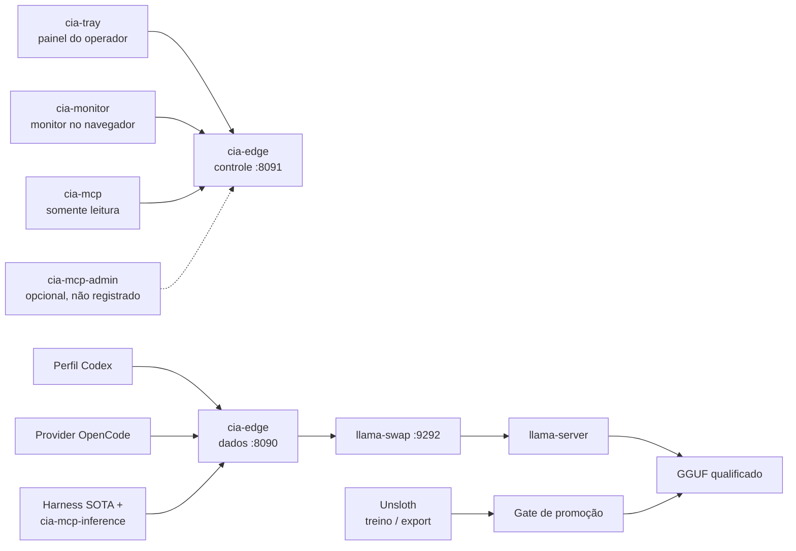

# Local AI Provider

**Português** · **[English](README.en.md)**

**Servidor de inferência compatível com a API da OpenAI, restrito a loopback, que permite rodar agentes de código contra um modelo local — sem que código-fonte, prompts ou credenciais saiam da máquina.**

[](https://go.dev/)
[](LICENSE)
[](#baseline-de-hardware)
[](https://github.com/Sitr3n01/IA_local_server/actions/workflows/ci.yml)
[](#status-do-projeto)

---

## O problema

Harnesses de código como Codex, Claude Code e OpenCode enviam prompts para um provedor na nuvem — e um prompt raramente é só uma pergunta. Ele carrega código-fonte, árvore de arquivos, estrutura de diretórios e schemas de ferramentas.

Apontar esses harnesses para um modelo local parece trivial: basta expor um endpoint compatível com a OpenAI e trocar a base URL. Feito sem cuidado, esse shim reintroduz silenciosamente todos os riscos que deveria eliminar:

- ele **encaminha o token bearer do cliente** para cima, porque proxies copiam headers por padrão;
- ele **cai para a nuvem** quando o modelo local dá erro, e aí falha vira exfiltração sem ninguém perceber;
- ele **loga corpos de request** para depuração, e aí prompts e credenciais vão parar em texto puro no disco;
- ele **escuta em `0.0.0.0`**, e aí qualquer dispositivo da rede alcança a API de inferência.

Este repositório é a versão cuidadosa desse shim. Cada uma dessas quatro falhas é um invariante testado e aplicado aqui — a terceira porque aconteceu de verdade no protótipo v1, e o [incidente está documentado abertamente](incident-reports/2026-07-20-panel-zstd-credential-exposure.md).

## O que é

Um control plane em Go na frente do `llama.cpp`, mais o encanamento de Windows necessário para rodá-lo como um serviço real e supervisionado:

| Responsabilidade | Dono |
|---|---|
| Loop do agente, contexto, execução de ferramentas, retries | **O harness** — nunca este servidor |
| Autenticação/autorização, validação, fila, cancelamento, adaptação de protocolo | `cia-edge` |
| Start preguiçoso do modelo, ciclo de vida de um modelo só, unload por ociosidade | `llama-swap` |
| Geração de tokens | `llama-server` sobre AMD ROCm |
| Guarda de credenciais, contenção de processo, backoff de reinício | `cia-supervisor` + Windows Credential Manager |

O limite de escopo é deliberado e é justamente o ponto: isto é um **plano de inferência e controle de admissão**, não um framework de agente. Não tem histórico de conversa, não tem armazenamento de prompt, não escolhe modelo, e não tem caminho de rede para nenhum provedor de nuvem.

> **Sobre o prefixo `cia-`:** vem da raiz de instalação `C:\IA` (*IA* = *inteligência artificial*). Nenhuma relação com a agência.

## Arquitetura


```mermaid
flowchart LR
    T["cia-tray<br/>painel do operador"] --> P
    W["cia-monitor<br/>monitor no navegador"] --> P
    C["Perfil Codex"] --> E
    O["Provider OpenCode"] --> E
    E["cia-edge<br/>dados :8090"] --> S
    P["cia-edge<br/>controle :8091"]
    S["llama-swap :9292"] --> L["llama-server"]
    L --> G["GGUF qualificado"]
    M["cia-mcp<br/>somente leitura"] --> P
    D["Harness SOTA +<br/>cia-mcp-inference"] --> E
    A["cia-mcp-admin<br/>opcional, não registrado"] -.-> P
    U["Unsloth<br/>treino / export"] --> Q["Gate de promoção"]
    Q --> G
```

As requisições entram apenas por loopback. O edge remove o header `Authorization` do cliente, valida o payload contra um contrato específico da rota, injeta uma credencial de router *separada*, e devolve os bytes do upstream de forma incremental com propagação de cancelamento. Rota desconhecida, modelo desconhecido, encoding não suportado ou formato de ferramenta malformado **falham fechado** — não existe segunda opinião para recorrer.

Detalhamento completo: [Arquitetura](docs/ARCHITECTURE.md) · [Threat model](docs/THREAT_MODEL.md) · [Runbook](docs/RUNBOOK.md) · [Tuning](docs/TUNING.md) · [ADRs](docs/adr/)

## Invariantes de segurança

Estes são aplicados em código e verificados por testes, não apenas documentados:

| Invariante | Como é aplicado |
|---|---|
| Todo listener é loopback literal | A config rejeita `0.0.0.0`, `::` e endereços de LAN; a auditoria de instalação inspeciona os listeners ativos |
| Credenciais do cliente nunca chegam ao modelo | O edge remove `Authorization` e cookies; verificado contra um upstream falso em testes de integração |
| Três segredos independentes | Credenciais distintas de inferência / administração / router no Windows Credential Manager |
| Nunca há fallback para nuvem | Nenhum upstream remoto é alcançável; allowlists de rota e modelo; regras de firewall bloqueando saída |
| Logs contêm apenas metadados | ID da requisição, método, rota sanitizada, status, latência. Nunca prompts, corpos, headers ou tokens |
| Descompressão limitada | Teto de 16 MiB na rede / 64 MiB decodificado / expansão 100:1 em identity, gzip e zstd |
| Concorrência limitada | Por padrão, uma inferência ativa, até 16 na fila e 120 s de espera; excesso ou timeout retorna `429` com `Retry-After`. A leitura limitada do corpo ocorre antes da espera e também tem limite de concorrência |
| Acesso direto ao modelo é autenticado | O `llama-server` exige o arquivo de chave do router; inferência sem credencial na porta dinâmica retorna `401` |
| Nenhum segredo em linha de comando | O supervisor injeta em uma allowlist de ambiente local ao processo |
| Nada sensível no Git | A CI rejeita binários e pesos rastreados; o Gitleaks varre o histórico completo |

A separação de privilégio é deliberada em todas as camadas: o control plane é um listener separado do data plane, o MCP administrativo é um **executável separado que nunca é registrado por padrão**, e o painel do operador só lê a credencial de administração numa mutação explícita — seu polling periódico de status é não autenticado e sanitizado, de forma que um impostor em loopback não tem caminho de captura desassistida.

## Componentes

| Executável | Função | Exposição |
|---|---|---|
| `cia-edge` | Data e control plane: auth, validação, fila, streaming | `127.0.0.1:18090` / `:18091` (canary); `:8090` / `:8091` (final) |
| `cia-supervisor` | Contenção em Job Object, backoff exponencial de reinício de 1 a 15 min | Ação de tarefa agendada |
| `cia-tray` | IA Local: ícone e flyout nativos no design do monitor — inicia e encerra o servidor, status, carregar/trocar/descarregar, abre o painel e os clientes | Área de notificação; única entrada de inicialização |
| `cia-monitor` | Monitor no navegador — fase da requisição, tokens/s, GPU, RAM, commit; carregar/descarregar modelo com confirmação nativa | `127.0.0.1:18095` (canary) / `:8095` (final) |
| `cia-credential` | Auxiliar do Windows Credential Manager | Somente processo local |
| `cia-mcp` | MCP operacional somente leitura (5 ferramentas sem efeito colateral) | stdio do harness |
| `cia-mcp-inference` | Uma ferramenta de delegação sem estado, só texto, para harnesses SOTA | stdio do harness |
| `cia-mcp-admin` | MCP de administração de ciclo de vida | **Não registrado por padrão** |
| `cia-mcp-smoke` | Teste ao vivo do `cia-mcp-inference` instalado: handshake MCP, superfície de uma ferramenta só, marcador sintético exato; relatório apenas com metadados | Operador; servidor MCP iniciado como filho por stdio |
| `cia-manifest` | Validação por JSON Schema do manifesto versionado de modelos | Operador / CI |
| `cia-fork-gate` | Gate de proveniência: decide se um commit pinado do `buun-llama-cpp` pode ser compilado e adotado como runtime agentic do Qwen3.8; não carrega modelo, não abre porta, não acessa a rede | Operador, via `Build-V2ForkRuntime.ps1` |
| `cia-console` | Console WebView2 da ADR 0018, congelado pela [ADR 0019](docs/adr/0019-browser-monitor.md): código mantido no repositório, sem desenvolvimento nem deploy | Não implantado |

## Práticas de engenharia

**Testes.** A suíte Go cobre credenciais, limites de corpos, fila, cancelamento, capacidades do modelo, adaptação de protocolos e caminhos negativos de autorização. Testes de transporte executam pipes descartáveis no Windows. O monitor ativo tem testes próprios de DOM; a suíte React cobre o console preservado pela ADR 0019. Execute `go test ./cmd/... ./internal/...` e, em `frontend`, `npm test` e `npm run test:monitor`; contagens e cobertura devem ser obtidas da execução atual.

**CI.** Os jobs em [ci.yml](.github/workflows/ci.yml) validam PowerShell e harnesses; Go com formatação/vet/[Staticcheck](https://staticcheck.dev/)/[govulncheck](https://go.dev/blog/govulncheck) e [SBOM CycloneDX](https://cyclonedx.org/); corridas no núcleo portável; proveniência do fork; segredos com [Gitleaks](https://github.com/gitleaks/gitleaks); frontend; e qualidade do frontend. Um passo dedicado quebra o build se um `.gguf`, `.safetensors`, `.exe` ou arquivo compactado for rastreado.

**Registros de decisão.** As [ADRs](docs/adr/) documentam o *porquê* da arquitetura, incluindo admissão, manifesto/promoção, segurança de artefatos, offload, monitor no navegador e instância local do Claude. Consulte os registros atuais para distinguir componentes ativos de componentes mantidos para compatibilidade.

**Reprodutibilidade.** Módulos diretos e transitivos são pinados, e [go.mod](go.mod) fixa o piso da toolchain em `go 1.26.6`. A CI resolve a versão de Go a partir desse arquivo. O deploy nunca copia do worktree: candidatos a release são compilados numa área de staging, revisados por SHA-256, e então instalados atomicamente num diretório protegido.

**Operações preview-first.** Os scripts PowerShell de deploy em [scripts/v2](scripts/v2/) fazem preview por padrão; alterações exigem `-Apply` explícito, e os launchers Start-V2 só iniciam um processo com `-Run`. Mudanças de firewall e ACL exigem adicionalmente um shell elevado e gravam um registro SDDL de recuperação antes da alteração. O `New-V2ClientCatalogs.ps1` não é um script de deploy: ele regrava diretamente os catálogos de clientes rastreados.

**Capacidades qualificadas.** O edge verifica a rota e os recursos pedidos contra `capabilities` do modelo antes de ocupar o slot de inferência. Nas rotas OpenAI (`/v1/chat/completions`, `/v1/responses`), requisições que exigem Responses, streaming, ferramentas, saída estruturada ou reasoning não qualificados retornam `400 unsupported_feature`. Em `/v1/messages`, chat ou streaming não qualificados, uma escolha obrigatória de ferramenta ou um histórico de ferramentas retornam `invalid_request_error`, e definições opcionais de ferramenta são omitidas para um modelo sem function calling. A existência de uma rota no edge não qualifica os modelos do manifesto. No adaptador Anthropic, escolhas explícitas de ferramenta são preservadas ou recusadas; um stream interrompido emite erro em vez de conclusão normal.

## Gate de promoção de modelo

Modelos não ficam disponíveis só por existirem em disco. Eles percorrem uma máquina de estados explícita:

```text
candidate ──▶ qualified ──▶ enabled ──▶ retired
    ▲             │
    └─────────────┘  regressão exige requalificação
```

`candidate` roda apenas nas portas de canary. Chegar a `qualified` exige hashes SHA-256 imutáveis, registros de licença e proveniência, testes de contrato de protocolo, envelopes medidos de RAM/commit/VRAM, evidência de recuperação de falha e resultados de soak. O gerador de configuração de produção **se recusa a emitir um modelo `candidate`** — ver [Promoção de modelo](docs/MODEL_PROMOTION.md).

## Status do projeto

**Canary v2. A promoção para produção está intencionalmente bloqueada.** O edge em Go, os servidores MCP, o manifesto, o router de ciclo de vida, o auxiliar de credenciais, o supervisor, o painel do operador, os scripts de deploy, os testes e a documentação estão implementados e passando. O que passou na validação de canary: Responses nativo, streaming SSE real, Chat Completions, zstd, function calling, estouro de fila, cancelamento, TTL/unload, descoberta MCP, reinício de router/edge e contenção por Job Object. O overhead p95 do edge foi medido dentro do ruído e abaixo do gate de 50 ms.

A revisão de 2026-10-01 corrigiu os launchers, os contratos de protocolo e a
admissão de memória durante trocas de modelo. O Qwen Agent concluiu uma sessão
real do Codex que corrigiu um fixture Go e executou seus testes, preservando os
testes originais. Deep e Agent passaram nos contratos nativos de Responses e
ferramentas; Gemma passou em Responses simples e continua sem ferramentas
qualificadas. A revalidação física do Huge e a qualificação/publicação dos
artefatos para produção permanecem pendentes. Resultados, limites e exceções
estão na [revisão de prontidão](docs/reports/2026-10-01-deploy-readiness.md).

O responsável pelo projeto dispensou explicitamente o soak de 72 horas nesta revisão de 2026-10-01. O resultado é registrado como `waived` (dispensado), sem evidência de estabilidade prolongada. Os quatro modelos ativos são o conjunto definitivo do projeto; as capacidades declaradas e as reservas de memória continuam exigindo evidência e validação. Veja a decisão em [Promoção de modelo](docs/MODEL_PROMOTION.md).

## Perfis Qwen

Três perfis, três finalidades. Selecione pelo id do modelo; trocar de perfil é
uma troca de modelo no llama-swap, não uma reconfiguração.

| Perfil | Pesos | KV | Contexto | Saída | Quando usar |
|---|---|---|---:|---:|---|
| `qwen38-27b-deep-32k` | Qwen3.8 27B UD-IQ4_XS | `q8_0`/`q8_0` | 32k | 8k | Tarefas difíceis e localizadas: algoritmos, arquitetura, bug complexo em poucos arquivos |
| **`qwen38-27b-agent-128k`** | Qwen3.8 27B UD-Q3_K_XL | `q4_0`/`q4_0` | 128k | 8k | **Padrão diário.** Codex, Claude Code, OpenCode, Unity, refactors, investigação de repositório |
| `qwen36-35b-a3b-huge-256k` | Qwen3.6 35B-A3B UD-Q2_K_XL | `q4_0`/`q4_0` | 256k | 16k | Contexto ativo enorme. MoE esparso: 35B de parâmetros, 3B ativos por token |

Regra de seleção: **confiabilidade de raciocínio → Deep. Trabalho normal de agente
→ Agent. Contexto ativo enorme → Huge.** Escolha Huge
quando o *working set* excede o do Agent, não quando a tarefa é apenas difícil.

O perfil Huge deixou de ser um Qwen3.8 denso a 2 bits e passou a ser um MoE em
2026-08-25. Um modelo que ativa 3B de 35B parâmetros segura a mesma janela com
mais throughput em profundidade, que é exatamente para o que um perfil de
contexto gigante existe. A decisão, o confronto que a produziu e o que foi
apagado do disco estão em
[FINAL-ROSTER-20260825](docs/reports/FINAL-ROSTER-20260825.md) e na
[ADR 0016](docs/adr/0016-one-moe-and-the-four-function-roster.md).

O Huge carrega `reasoning_budget: 6144` sob um teto `n_predict: 16384`. Isso não
é enfeite: sem o orçamento, este modelo gasta 8.192 tokens inteiros pensando e
devolve resposta vazia nas tarefas de coding mais difíceis — três casos em
trinta e quatro, medidos.

O padrão diário é o Agent, não o Deep: um harness de coding gasta dezenas de
milhares de tokens em system prompt, definições de ferramentas, arquivos, logs e
histórico antes de o problema chegar.

Detalhes, evidência medida e limitações conhecidas: [TUNING §1.8](docs/TUNING.md)
e [RUNBOOK §13](docs/RUNBOOK.md). Há medições de retenção para o Agent na
[campanha de qualificação](docs/reports/QUALIFICATION-CAMPAIGN-20260823.md) de
2026-08-23 e para o Huge atual (Qwen3.6) no
[relatório de roster](docs/reports/FINAL-ROSTER-20260825.md) de 2026-08-25; a
linha Huge da campanha é o perfil Qwen3.8 denso aposentado. A qualificação
completa dos artefatos e da configuração atual continua registrada separadamente
da escolha dos quatro modelos definitivos.

## Baseline de hardware

Desenvolvido contra AMD ROCm no Windows. O runtime é pinado pelo SHA-256 medido em vez do rótulo do diretório, porque nomes de arquivo do fornecedor se provaram pouco confiáveis como identidade de versão. Metodologia de benchmark e resultados registrados: [Benchmarks](docs/BENCHMARKS.md).

## Build

```bash
go test -race ./...
go vet ./...
go build -trimpath -o bin/cia-edge.exe ./cmd/cia-edge
go build -trimpath -ldflags="-H=windowsgui" -o bin/cia-tray.exe ./cmd/cia-tray
```

Os binários restantes seguem o mesmo padrão sob `./cmd/`. Essas saídas são descartáveis, de desenvolvimento — o deploy usa o caminho com staging e revisão de hash descrito no [Runbook](docs/RUNBOOK.md).

## Deploy

Os scripts fazem preview por padrão; mutação é sempre uma invocação separada e explícita.

```powershell
# Valida os metadados rastreados de modelo e de harness
.\scripts\v2\Test-V2Manifest.ps1
.\scripts\v2\Test-V2HarnessConfig.ps1

# Inicializa apenas os segredos ausentes; credenciais existentes são preservadas
.\scripts\v2\Initialize-V2Secrets.ps1 -Apply

# Preview e então geração do deploy de canary
.\scripts\v2\New-V2Config.ps1 -Environment Canary
.\scripts\v2\New-V2Config.ps1 -Environment Canary -Apply
```

## Monitor no navegador

O `cia-monitor` serve uma página em loopback que mostra, a cada segundo, o que o servidor está fazendo: a fase da requisição (na fila, carregando o modelo, lendo o prompt, gerando), tokens por segundo, tempo até o primeiro token, reaproveitamento de cache e ocupação do contexto, além de GPU, VRAM, memória compartilhada, CPU, RAM, commit e disco.

Não depende do edge para enxergar a máquina: mostra a energia que a GPU consome (watts, temperatura, clocks e energia acumulada na sessão), quais processos usam a GPU e quais outras ferramentas estão servindo um modelo — LM Studio / Bionic, Ollama, llama.cpp avulso e servidores compatíveis com OpenAI —, com modelo, quantização e janela de contexto quando a API da ferramenta informa, e sinaliza atividade mesmo que o edge esteja fora do ar (ADR 0020). Para o tráfego que passa pelo edge a velocidade por requisição vem da telemetria dele; para servidores llama.cpp de outras ferramentas (LM Studio / Bionic, ou um `llama-server` iniciado com `--log-file`) o monitor lê os contadores que o próprio servidor escreve no log — prompt, cache, saída, tokens por segundo, tempo até o primeiro token — sem ler texto, e mostra tudo na mesma tabela, com a origem que atendeu (o edge ou a ferramenta) indicada sob o nome de cada modelo. Ferramentas sem log por requisição (Ollama, por exemplo) aparecem como "externa" (duração, pico de GPU e de potência, energia da placa) e o cartão da fonte explica por quê. Para um modelo que outra ferramenta carregou, cada fonte tem um botão "Encerrar processo do modelo", que pede confirmação numa janela do Windows.

`/api/snapshot` inclui `requests[]`, uma lista limitada aos registros recentes com métricas por requisição de ambas as origens, e `coverage`, que distingue fontes externas medidas das que mostram apenas atividade. Cada registro indica de onde veio cada número em `measurements`; prompt e cache calculados do log e velocidades estimadas são identificados, e valores ausentes continuam `null`. Essa cobertura se refere às fontes detectadas: uma ferramenta que não passa pelo edge nem publica métricas por resposta ou log não permite contagem exata apenas pela GPU.

A página também carrega o modelo escolhido e descarrega o carregado — e só isso. Cada pedido segue pelo pipe administrativo do edge, sem credencial, e só é executado depois que você confirma numa janela do Windows que a página não alcança (Cancelar é o padrão; sem resposta em 45 s, nada acontece). O monitor aceita esses pedidos apenas da própria página, vindos de um processo do mesmo usuário que roda o servidor. `-admin-pipe off` desliga os botões. Iniciar e encerrar o servidor ficam com o `cia-tray` (IA Local); drenagem e retomada ficam com o `cia-mcp-admin` e com a transação de release.

```powershell
go build -trimpath -o bin/cia-monitor.exe ./cmd/cia-monitor
.\bin\cia-monitor.exe -open                      # canary: http://127.0.0.1:18095
.\bin\cia-monitor.exe -environment final -open   # final:  http://127.0.0.1:8095
```

Os números por requisição vêm de `/api/v1/inference`, publicado pelo edge; com um edge anterior a essa rota a página continua funcionando e avisa que a telemetria está indisponível. Rodar `-open` com o monitor já aberto apenas abre a página existente. Decisão e controles: [ADR 0019](docs/adr/0019-browser-monitor.md).

Os templates de integração de harness ficam em [`integrations/`](integrations/) e não contêm segredos. O Codex mantém seu login normal da OpenAI intocado — o acesso local é um perfil selecionado explicitamente, com endpoint e modelo pinados na precedência de CLI, de modo que uma configuração no nível do repositório não consiga redirecionar silenciosamente uma sessão que o usuário pediu para manter local.

## Mapa do repositório

```
cmd/                 um diretório por executável Go (edge, supervisor, tray, monitor, servidores MCP,
                     ferramental, console congelado)
internal/            pacotes Go: edge, adminpipe, credential, supervisor, monitor, trayui + panel,
                     servidores MCP, claudedesktop, forkgate, manifestvalidator, rotatelog
config/              manifesto versionado de modelos + JSON Schema (fonte da verdade), template do
                     llama-swap, referência de configurações do edge (nenhum programa a lê),
                     procedimento de override de chat template (nenhum em uso)
scripts/v2/          scripts PowerShell de deploy (preview-first; -Apply para alterar, -Run nos
                     launchers Start-V2), drivers de qualificação e medição, gerador de catálogos
                     de clientes (grava direto); eval/ em Python
scripts/             ferramental por perfil, em sua maioria guiado por model-test-matrix.json:
                     downloads, llama-bench e benchmark de chat, smoke, avaliações de qualidade e
                     stress, launcher avulso do llama-server e listagem de dispositivos,
                     sincronização de catálogos Codex/Unsloth, auxiliares do Unsloth
integrations/        launchers e templates de perfil para Codex, OpenCode e Unsloth; notas de
                     registro da ponte MCP de inferência (sem segredos)
frontend/            console React congelado pela ADR 0019 + lint e testes de DOM do monitor ativo
docs/                arquitetura, threat model, runbook, benchmarks, promoção, tuning, Claude Desktop,
                     frontend, ADRs, relatórios
incident-reports/    registro sanitizado da exposição de credencial da v1
benchmarks/          evidência registrada de benchmark e qualificação de modelos
.github/workflows/   CI e release
```

## Documentação

A documentação longa é escrita em inglês.

| Documento | Conteúdo |
|---|---|
| [Arquitetura](docs/ARCHITECTURE.md) | Contratos de componente, máquina de estados, comportamento em falha, invariantes arquiteturais |
| [Threat model](docs/THREAT_MODEL.md) | Ativos, fronteiras de confiança, matriz ameaça/controle/verificação, riscos residuais |
| [Runbook](docs/RUNBOOK.md) | Procedimentos operacionais e fronteiras de rollback |
| [Promoção de modelo](docs/MODEL_PROMOTION.md) | Critérios de qualificação e aplicação do gate |
| [Benchmarks](docs/BENCHMARKS.md) | Metodologia de medição e formato de evidência |
| [Tuning](docs/TUNING.md) | Diagnóstico de gargalo e teto de banda de memória |
| [Claude Desktop](docs/CLAUDE_DESKTOP.md) | Contrato do Claude Desktop como cliente de inferência de terceiros; instância local ao lado da conectada |
| [Frontend](docs/FRONTEND.md) | Referência do console React congelado: camadas, regras de importação, testes |
| [ADRs](docs/adr/) | Registros de decisão arquitetural |
| [Relatórios](docs/reports/) | Validações de canary, campanhas de qualificação, auditorias e revisões de prontidão |
| [Política de segurança](SECURITY.md) | Processo de reporte |

## Licença

O código-fonte é [Apache-2.0](LICENSE). Licenças e hashes de terceiros estão registrados no [NOTICE](NOTICE) e no manifesto de modelos. Nenhum peso de modelo ou executável de runtime é redistribuído.
