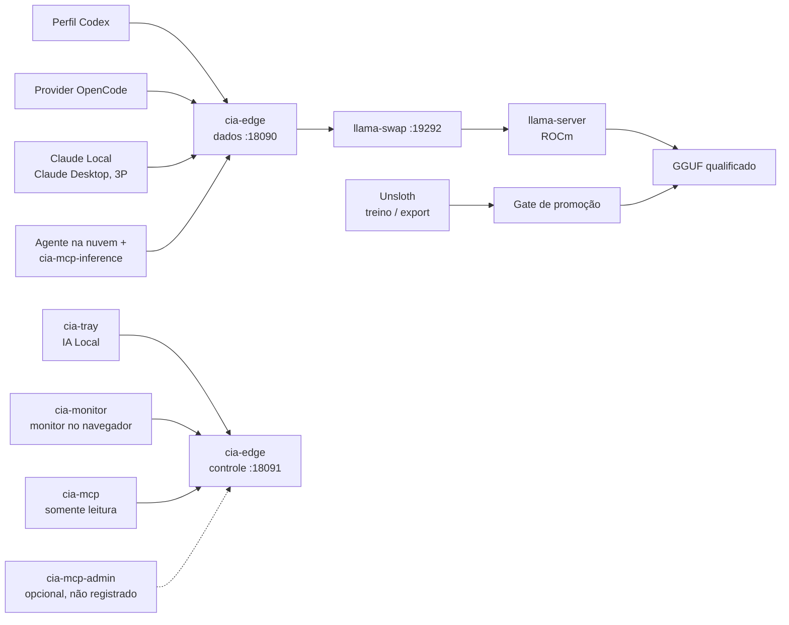

# Local AI Provider

**[English](README.md)** · **Português (Brasil)**

**Servidor de inferência compatível com a API da OpenAI, restrito a loopback, que permite rodar agentes de código contra um modelo local — sem que código-fonte, prompts ou credenciais saiam da máquina.**

[](https://github.com/Sitr3n01/local-ai-provider/actions/workflows/ci.yml)
[](https://github.com/Sitr3n01/local-ai-provider/actions/workflows/codeql.yml)
[](https://github.com/Sitr3n01/local-ai-provider/releases)
[](go.mod)
[](LICENSE)
[](#baseline-de-hardware)

<p align="center">
  
  <br>
  <sub>O monitor no navegador sobre o canary em execução, ocioso. Os selos <i>admite</i> indicam se o modelo selecionado cabe em RAM e commit neste momento.</sub>
</p>

## O problema

Harnesses de código como Codex, Claude Code e OpenCode enviam prompts para um provedor na nuvem — e um prompt raramente é só uma pergunta. Ele carrega código-fonte, árvore de arquivos, estrutura de diretórios e schemas de ferramentas.

Apontar esses harnesses para um modelo local parece trivial: basta expor um endpoint compatível com a OpenAI e trocar a base URL. Feito sem cuidado, esse shim reintroduz silenciosamente todos os riscos que deveria eliminar:

- ele **encaminha o token bearer do cliente** para cima, porque proxies copiam headers por padrão;
- ele **cai para a nuvem** quando o modelo local dá erro, e aí falha vira exfiltração sem ninguém perceber;
- ele **loga corpos de request** para depuração, e aí prompts e credenciais vão parar em texto puro no disco;
- ele **escuta em `0.0.0.0`**, e aí qualquer dispositivo da rede alcança a API de inferência.

Este repositório é a versão cuidadosa desse shim. Cada uma dessas quatro falhas é um invariante testado e aplicado aqui — a terceira porque aconteceu de verdade no protótipo v1, e o [incidente está documentado abertamente](incident-reports/2026-07-20-panel-zstd-credential-exposure.md).

## O que é

Um control plane em Go na frente do `llama.cpp`, mais o encanamento de Windows necessário para rodá-lo como um serviço real e supervisionado:

| Responsabilidade | Dono |
|---|---|
| Loop do agente, contexto, execução de ferramentas, retries | **O harness** — nunca este servidor |
| Autenticação/autorização, validação, fila, cancelamento, adaptação de protocolo | `cia-edge` |
| Start preguiçoso do modelo, ciclo de vida de um modelo só, unload por ociosidade | `llama-swap` |
| Geração de tokens | `llama-server` sobre AMD ROCm |
| Guarda de credenciais, contenção de processo, backoff de reinício | `cia-supervisor` + Windows Credential Manager |

O limite de escopo é deliberado e é justamente o ponto: isto é um **plano de inferência e controle de admissão**, não um framework de agente. Não tem histórico de conversa, não tem armazenamento de prompt, não escolhe modelo e não tem caminho de rede para nenhum provedor de nuvem.

> **Nomes.** O projeto se chama *Local AI Provider*. O app da bandeja do Windows se chama *IA Local*, e todo executável leva o prefixo `cia-`, da raiz de instalação `C:\IA` (*IA* = *inteligência artificial*). Nenhuma relação com a agência.

## Resultados em resumo

Medidos no [hardware abaixo](#baseline-de-hardware). Cada linha aponta para a evidência versionada de onde vem.

| Medida | Resultado | Evidência |
|---|---|---|
| Overhead do edge | p95 de **18,2 ms** em 30 pares de requisições curtas e aquecidas, contra um gate de 50 ms; diferença de throughput de −0,085%, dentro do ruído | [Revisão de prontidão](docs/reports/2026-10-01-deploy-readiness.md#evidence-completed-in-this-review) |
| Retenção de contexto longo, Qwen3.6 35B-A3B | **120/120** verificações de fatos plantados em dez níveis de ocupação, até 240k tokens | [Roster final §C](docs/reports/FINAL-ROSTER-20260825.md#c-retention) |
| Retenção de contexto longo, Gemma 4 12B | **59/60** até 240k tokens na janela de 256k | [Roster final](docs/reports/FINAL-ROSTER-20260825.md#retention-up-the-ramp) |
| Decode com o contexto preenchido, Qwen3.6 35B-A3B | **50,4 tok/s** com 120k tokens, **32,9 tok/s** com 240k | [Roster final §D](docs/reports/FINAL-ROSTER-20260825.md#d-performance-with-the-context-filled) |
| Sessão real de agente | O Codex no perfil Agent rodou um teste Go que falhava, corrigiu o código e deixou a suíte passando em **114 s**, sem alterar os testes originais | [Revisão de prontidão](docs/reports/2026-10-01-deploy-readiness.md#real-model-contracts) |
| Contratos de protocolo | **27** (Deep) e **28** (Agent) verificações aprovadas: Responses nativo, ferramentas com namespace, SSE, cancelamento, recuperação | [Revisão de prontidão](docs/reports/2026-10-01-deploy-readiness.md#real-model-contracts) |
| Suíte de testes | **728** testes e subtestes Go no Windows; **653** com `-race` no Linux (2026-10-01) | [Revisão de prontidão](docs/reports/2026-10-01-deploy-readiness.md#evidence-completed-in-this-review) |
| Builds reprodutíveis | Edge e MCP administrativo recompilados com SHA-256 idêntico | [Revisão de prontidão](docs/reports/2026-10-01-deploy-readiness.md#evidence-completed-in-this-review) |

## Arquitetura



As portas são as do canary; o deploy final usa `8090`, `8091` e `9292`. As requisições entram apenas por loopback. O edge remove o header `Authorization` do cliente, valida o payload contra um contrato específico da rota, injeta uma credencial de router *separada* e devolve os bytes do upstream de forma incremental, com propagação de cancelamento. Rota desconhecida, modelo desconhecido, encoding não suportado ou formato de ferramenta malformado **falham fechado** — não existe segunda opinião para recorrer.

Detalhamento completo (em inglês): [Arquitetura](docs/ARCHITECTURE.md) · [Threat model](docs/THREAT_MODEL.md) · [Runbook](docs/RUNBOOK.md) · [Tuning](docs/TUNING.md) · [ADRs](docs/adr/README.md)

## Invariantes de segurança

Estes são aplicados em código e verificados por testes, não apenas documentados:

| Invariante | Como é aplicado |
|---|---|
| Todo listener é loopback literal | A config rejeita `0.0.0.0`, `::` e endereços de LAN; a auditoria de instalação inspeciona os listeners ativos |
| Credenciais do cliente nunca chegam ao modelo | O edge remove `Authorization` e cookies; verificado contra um upstream falso em testes de integração |
| Três segredos independentes | Credenciais distintas de inferência / administração / router no Windows Credential Manager |
| Nunca há fallback para nuvem | Nenhum upstream remoto é alcançável; allowlists de rota e modelo; regras de firewall bloqueando saída |
| Logs contêm apenas metadados | ID da requisição, método, rota sanitizada, status, latência. Nunca prompts, corpos, headers ou tokens |
| Descompressão limitada | Teto de 16 MiB na rede / 64 MiB decodificado / expansão 100:1 em identity, gzip e zstd |
| Concorrência limitada | Por padrão, uma inferência ativa, até 16 na fila e 120 s de espera; excesso ou timeout retorna `429` com `Retry-After`. A leitura limitada do corpo ocorre antes da espera e também tem limite de concorrência |
| Acesso direto ao modelo é autenticado | O `llama-server` exige o arquivo de chave do router; inferência sem credencial na porta dinâmica retorna `401` |
| Nenhum segredo em linha de comando | O supervisor injeta em uma allowlist de ambiente local ao processo |
| Nada sensível no Git | A CI rejeita binários e pesos rastreados; o Gitleaks varre o histórico completo |

A separação de privilégio é deliberada em todas as camadas: o control plane é um listener separado do data plane, o MCP administrativo é um **executável separado que nunca é registrado por padrão**, e a bandeja só lê a credencial de administração numa mutação explícita — seu polling periódico de status é não autenticado e sanitizado, de forma que um impostor em loopback não tem caminho de captura desassistida.

## Componentes

| Executável | Função | Exposição |
|---|---|---|
| `cia-edge` | Data e control plane: auth, validação, fila, streaming | `127.0.0.1:18090` / `:18091` (canary); `:8090` / `:8091` (final) |
| `cia-supervisor` | Contenção em Job Object, backoff exponencial de reinício de 1 a 15 min | Ação de tarefa agendada |
| `cia-tray` | IA Local: ícone e flyout nativos no design do monitor — inicia e encerra o servidor, status, carregar/trocar/descarregar, abre o monitor e os clientes | Área de notificação; única entrada de inicialização |
| `cia-monitor` | Monitor no navegador — fase da requisição, tokens/s, GPU, RAM, commit; carregar/descarregar modelo com confirmação nativa | `127.0.0.1:18095` (canary) / `:8095` (final) |
| `cia-credential` | Auxiliar do Windows Credential Manager | Somente processo local |
| `cia-mcp` | MCP operacional somente leitura (5 ferramentas sem efeito colateral) | stdio do harness |
| `cia-mcp-inference` | Uma ferramenta sem estado, só texto, com que um agente de código na nuvem entrega uma subtarefa ao modelo local | stdio do harness |
| `cia-mcp-admin` | MCP de administração de ciclo de vida | **Não registrado por padrão** |
| `cia-mcp-smoke` | Teste ao vivo do `cia-mcp-inference` instalado: handshake MCP, superfície de uma ferramenta só, marcador sintético exato; relatório apenas com metadados | Operador; servidor MCP iniciado como filho por stdio |
| `cia-manifest` | Validação por JSON Schema do manifesto versionado de modelos | Operador / CI |
| `cia-fork-gate` | Gate de proveniência: decide se um commit pinado do `buun-llama-cpp` pode ser compilado e adotado como runtime agentic do Qwen3.8; não carrega modelo, não abre porta, não acessa a rede | Operador, via `Build-V2ForkRuntime.ps1` |

## Roster de modelos

Quatro modelos, quatro funções. O cliente escolhe pelo id do modelo; trocar é uma troca de modelo no llama-swap, não uma reconfiguração. Os quatro estão como `candidate` no canary — veja [Status do projeto](#status-do-projeto).

| Id do modelo | Pesos | Cache KV | Contexto | Saída máx. | Função |
|---|---|---|---:|---:|---|
| `gemma4-12b-qat-ud-q4xl-256k` | Gemma 4 12B QAT UD-Q4_K_XL | `q4_0`/`q4_0` | 256k | 8k | **Modelo público**: inferência simples e a ferramenta de delegação sem estado. Sem ferramentas qualificadas |
| `qwen38-27b-deep-32k` | Qwen3.8 27B UD-IQ4_XS | `q8_0`/`q8_0` | 32k | 8k | Tarefas difíceis e localizadas: algoritmos, arquitetura, bug complexo em poucos arquivos |
| **`qwen38-27b-agent-128k`** | Qwen3.8 27B UD-Q3_K_XL | `q4_0`/`q4_0` | 128k | 8k | **Padrão para agentes de código** (Codex, Claude Code, OpenCode): refactors, investigação de repositório |
| `qwen36-35b-a3b-huge-256k` | Qwen3.6 35B-A3B UD-Q2_K_XL | `q4_0`/`q4_0` | 256k | 16k | Contexto ativo enorme. MoE esparso: 35B de parâmetros, 3B ativos por token |

Regra de seleção: **confiabilidade de raciocínio → Deep. Trabalho normal de agente → Agent. Contexto ativo enorme → Huge.** Escolha Huge quando o *working set* excede o do Agent, não quando a tarefa é apenas difícil. O padrão para agentes é o Agent, não o Deep: um harness de código gasta dezenas de milhares de tokens em system prompt, definições de ferramentas, arquivos, logs e histórico antes de o problema chegar.

Gemma e Huge carregam `reasoning_budget: 6144` sob um teto de 16.384 tokens no servidor (`n_predict`). Isso não é enfeite: sem o orçamento, um modelo que pensa pode gastar toda a cota raciocinando e devolver resposta vazia — medido nas tarefas de código mais difíceis. O Huge virou um MoE em 2026-08-25, porque um modelo que ativa 3B de 35B parâmetros segura a mesma janela com mais throughput em profundidade; o confronto que decidiu isso está em [FINAL-ROSTER-20260825](docs/reports/FINAL-ROSTER-20260825.md) e na [ADR 0016](docs/adr/0016-one-moe-and-the-four-function-roster.md).

<details>
<summary>Screenshot: os quatro modelos no monitor, com capacidades e admissão ao vivo</summary>
<br>

<br>
<sub>Capturado na release canary instalada de 2026-10-01, anterior à qualificação de Responses que já está no manifesto. O cartão do Huge mostra o controle de admissão funcionando: o modelo precisa de 18,2 GiB de RAM física, então o edge recusa o carregamento em vez de deixá-lo paginar.</sub>
</details>

Detalhes, evidência medida e limitações conhecidas: [TUNING §1.8](docs/TUNING.md) e [RUNBOOK §13](docs/RUNBOOK.md).

## Gate de promoção de modelo

Modelos não ficam disponíveis só por existirem em disco. Eles percorrem uma máquina de estados explícita:

```text
candidate ──▶ qualified ──▶ enabled ──▶ retired
    ▲             │
    └─────────────┘  regressão exige requalificação
```

`candidate` roda apenas nas portas de canary. Chegar a `qualified` exige hashes SHA-256 imutáveis, registros de licença e proveniência, testes de contrato de protocolo, envelopes medidos de RAM/commit/VRAM, evidência de recuperação de falha e resultados de soak. O gerador de configuração de produção **se recusa a emitir um modelo `candidate`** — ver [Promoção de modelo](docs/MODEL_PROMOTION.md).

## Status do projeto

**Canary v2 — a promoção para produção está intencionalmente bloqueada.** O edge, os servidores MCP, o manifesto, o router de ciclo de vida, o auxiliar de credenciais, o supervisor, a bandeja, o monitor, os scripts de deploy, os testes e a documentação estão implementados e passam na CI. A validação de canary cobriu Responses nativo, streaming SSE real, Chat Completions, zstd, function calling, estouro de fila, cancelamento, TTL/unload, descoberta MCP, reinício de router/edge e contenção por Job Object.

A [revisão de prontidão de 2026-10-01](docs/reports/2026-10-01-deploy-readiness.md) corrigiu os launchers, os contratos de protocolo e a admissão de memória durante trocas de modelo, e só qualificou capacidades com evidência de contrato registrada. O que ainda bloqueia a produção:

- **A revalidação física do perfil Huge.** O gate de admissão exige 18,2 GiB de RAM livre e recusa o carregamento com a carga atual da estação; nenhuma reserva foi reduzida para fazê-lo passar.
- **A qualificação e a publicação dos artefatos de produção** no armazenamento protegido.

O responsável pelo projeto dispensou explicitamente o soak de 72 horas nessa revisão. Ele é registrado como `waived` (dispensado), não como evidência de estabilidade prolongada. Veja [Promoção de modelo](docs/MODEL_PROMOTION.md).

## Baseline de hardware

| Peça | Especificação |
|---|---|
| GPU | AMD Radeon RX 9070 XT, 16 GB (gfx1201), ROCm |
| CPU | AMD Ryzen 7 7700X, 8 núcleos / 16 threads |
| Memória | 32 GB DDR5-6000 |
| Sistema | Windows 11 Pro |

O runtime é pinado pelo SHA-256 medido em vez do rótulo do diretório, porque nomes de arquivo do fornecedor se provaram pouco confiáveis como identidade de versão. Numa placa de 16 GB, os perfis densos Qwen3.8 27B mantêm parte do modelo na CPU, trocando velocidade por qualidade: cerca de 4–7 tok/s de decode, contra aproximadamente 28–55 tok/s do Gemma e do MoE. Metodologia e resultados registrados: [Benchmarks](docs/BENCHMARKS.md) e a [campanha de qualificação](docs/reports/QUALIFICATION-CAMPAIGN-20260823.md).

## Primeiros passos

### Pré-requisitos

- Windows 11 com PowerShell 5.1 ou superior.
- Go 1.26.6 ou superior (o [go.mod](go.mod) fixa o piso da toolchain; a CI resolve a versão a partir dele).
- Para servir modelos: GPU AMD com um build ROCm do `llama-server`, e o `llama-swap` — instalados como artefatos pinados e verificados por hash, conforme o [Runbook](docs/RUNBOOK.md#2-install-pinned-artifacts).
- Node.js 20.19 ou superior, apenas para o lint e os testes de DOM da página do monitor.

### Build e testes

```powershell
go test ./...
go vet ./...
go build -trimpath -o bin/cia-edge.exe ./cmd/cia-edge
go build -trimpath -ldflags="-H=windowsgui" -o bin/cia-tray.exe ./cmd/cia-tray

# Lint e testes de DOM da página do monitor
cd frontend; npm ci; npm run lint:monitor; npm run test:monitor
```

Os binários restantes seguem o mesmo padrão sob `./cmd/`. O detector de corridas precisa de cgo, então a CI roda `go test -race ./...` no Linux, onde as build tags deixam de fora o código exclusivo do Windows; no Windows, rode pelo WSL ou com `CGO_ENABLED=1` e um compilador C no `PATH`. Essas saídas são descartáveis, de desenvolvimento — o deploy usa o caminho com staging e revisão de hash descrito no [Runbook](docs/RUNBOOK.md).

### Deploy

Os scripts fazem preview por padrão; mutação é sempre uma invocação separada e explícita.

```powershell
# Valida os metadados rastreados de modelo e de harness
.\scripts\v2\Test-V2Manifest.ps1
.\scripts\v2\Test-V2HarnessConfig.ps1

# Inicializa apenas os segredos ausentes; credenciais existentes são preservadas
.\scripts\v2\Initialize-V2Secrets.ps1 -Apply

# Preview e então geração do deploy de canary
.\scripts\v2\New-V2Config.ps1 -Environment Canary
.\scripts\v2\New-V2Config.ps1 -Environment Canary -Apply
```

## Interfaces do operador

**Monitor no navegador (`cia-monitor`).** Uma página em loopback que mostra, a cada segundo, o que o servidor está fazendo — a fase da requisição, tokens por segundo, tempo até o primeiro token, reaproveitamento de cache e ocupação do contexto — junto com GPU, energia, VRAM, CPU, RAM, commit e disco. Também enxerga outros servidores de modelo locais (LM Studio, Ollama, llama.cpp avulso) sem depender do edge, e só carrega ou descarrega um modelo depois de uma confirmação nativa do Windows que a página não alcança. Não guarda credencial. Detalhes: [Monitor](docs/MONITOR.md) · [ADR 0019](docs/adr/0019-browser-monitor.md) · [ADR 0020](docs/adr/0020-monitor-describes-the-machine.md).

```powershell
go build -trimpath -o bin/cia-monitor.exe ./cmd/cia-monitor
.\bin\cia-monitor.exe -open                      # canary: http://127.0.0.1:18095
.\bin\cia-monitor.exe -environment final -open   # final:  http://127.0.0.1:8095
```

**Bandeja (`cia-tray`, IA Local).** A única entrada de inicialização do deploy: inicia e encerra o servidor, mostra o status, carrega, troca e descarrega modelos, e abre o Claude Local ao lado do Claude Desktop conectado. Veja a [ADR 0021](docs/adr/0021-ia-local-tray-owns-startup.md) e [Claude Desktop](docs/CLAUDE_DESKTOP.md).

**Integrações de harness.** Os templates para Codex, OpenCode e Unsloth ficam em [`integrations/`](integrations/) e não contêm segredos. O Codex mantém seu login normal da OpenAI intocado — o acesso local é um perfil selecionado explicitamente, com endpoint e modelo pinados na precedência de CLI, de modo que uma configuração no nível do repositório não consiga redirecionar silenciosamente uma sessão que o usuário pediu para manter local.

## Práticas de engenharia

**Testes.** A suíte Go cobre credenciais, limites de corpo, fila, cancelamento, capacidades do modelo, adaptação de protocolos e caminhos negativos de autorização. Testes de transporte usam pipes descartáveis no Windows.

**CI.** Os jobs em [ci.yml](.github/workflows/ci.yml) validam PowerShell e templates de harness; Go com formatação, vet, [Staticcheck](https://staticcheck.dev/), [govulncheck](https://go.dev/blog/govulncheck) e [SBOM CycloneDX](https://cyclonedx.org/); corridas no núcleo portável; proveniência do fork; segredos com [Gitleaks](https://github.com/gitleaks/gitleaks) no histórico completo; e lint e testes de DOM da página do monitor. O [CodeQL](.github/workflows/codeql.yml) analisa o código Go, JavaScript, Python e dos workflows, e o Dependabot mantém atualizados os módulos e actions pinados. Um passo dedicado quebra o build se um `.gguf`, `.safetensors`, `.exe` ou arquivo compactado for rastreado. Os seis checks da CI são obrigatórios na `main`.

**Capacidades qualificadas.** Antes de uma requisição ocupar o slot de inferência, o edge confere a rota e os recursos pedidos — Responses, streaming, ferramentas, saída estruturada, reasoning — contra as `capabilities` qualificadas do modelo no manifesto. Um recurso não qualificado é recusado com `400 unsupported_feature` nas rotas OpenAI e com `invalid_request_error` em `/v1/messages`; a existência de uma rota no edge nunca qualifica um modelo.

**Registros de decisão.** As [ADRs](docs/adr/README.md) documentam o *porquê* da arquitetura — admissão, manifesto e promoção, segurança de artefatos, offload, o monitor no navegador e a instância local do Claude.

**Reprodutibilidade.** Módulos diretos e transitivos são pinados. O deploy nunca copia do worktree: candidatos a release são compilados numa área de staging, revisados por SHA-256 e então instalados atomicamente num diretório protegido. As [releases](https://github.com/Sitr3n01/local-ai-provider/releases) trazem os binários de Windows, um SBOM e o `SHA256SUMS`.

**Operações preview-first.** Os scripts PowerShell de deploy em [scripts/v2](scripts/v2/) fazem preview por padrão; alterações exigem `-Apply` explícito, e os launchers Start-V2 só iniciam um processo com `-Run`. Mudanças de firewall e ACL exigem adicionalmente um shell elevado e gravam um registro SDDL de recuperação antes da alteração. O `New-V2ClientCatalogs.ps1` não é um script de deploy: ele regrava diretamente os catálogos de clientes rastreados.

## Como foi construído

Um projeto solo, construído com assistentes de código com IA: principalmente o Claude Code, com o OpenAI Codex em passadas de revisão e prontidão. Isso aparece no histórico — a maioria dos commits tem o trailer `Co-Authored-By`, e os cinco primeiros pull requests vieram de sessões do Claude Code. O responsável pelo projeto define a direção e toma as decisões que os documentos registram: escopo e fronteiras de confiança, quais modelos entram no roster e quais são aposentados, o que conta como qualificado, e o que foi dispensado e por quê. Toda mudança, seja quem for que a redigiu, passa pelos mesmos gates — testes, análise estática, varredura de segredos e evidência medida antes de promover uma capacidade ou um modelo.

## Mapa do repositório

```
cmd/                 um diretório por executável Go (edge, supervisor, tray, monitor, servidores MCP,
                     ferramental)
internal/            pacotes Go: edge, adminpipe, credential, supervisor, monitor, trayui + panel,
                     servidores MCP, claudedesktop, forkgate, manifestvalidator, rotatelog
config/              manifesto versionado de modelos + JSON Schema (fonte da verdade), template do
                     llama-swap, referência de configurações do edge (nenhum programa a lê),
                     procedimento de override de chat template (nenhum em uso)
scripts/v2/          scripts PowerShell de deploy (preview-first; -Apply para alterar, -Run nos
                     launchers Start-V2), drivers de qualificação e medição, gerador de catálogos
                     de clientes (grava direto); eval/ em Python
scripts/             ferramental por perfil, em sua maioria guiado por model-test-matrix.json:
                     downloads, llama-bench e benchmark de chat, smoke, avaliações de qualidade e
                     stress, launcher avulso do llama-server e listagem de dispositivos,
                     sincronização de catálogos Codex/Unsloth, auxiliares do Unsloth
integrations/        launchers e templates de perfil para Codex, OpenCode e Unsloth; notas de
                     registro da ponte MCP de inferência (sem segredos)
frontend/            lint e testes de DOM da página do monitor (Node; nada aqui é compilado ou distribuído)
docs/                arquitetura, threat model, runbook, benchmarks, promoção, tuning, monitor,
                     Claude Desktop, ADRs, relatórios, imagens
incident-reports/    registro sanitizado da exposição de credencial da v1
benchmarks/          evidência registrada de benchmark e qualificação (apenas entradas sintéticas)
.github/             CI, CodeQL, release, Dependabot, templates de issue e de pull request
```

## Documentação

A documentação longa é escrita em inglês.

| Documento | Conteúdo |
|---|---|
| [Arquitetura](docs/ARCHITECTURE.md) | Contratos de componente, máquina de estados, comportamento em falha, invariantes arquiteturais |
| [Threat model](docs/THREAT_MODEL.md) | Ativos, fronteiras de confiança, matriz ameaça/controle/verificação, riscos residuais |
| [Runbook](docs/RUNBOOK.md) | Procedimentos operacionais e fronteiras de rollback |
| [Promoção de modelo](docs/MODEL_PROMOTION.md) | Critérios de qualificação e aplicação do gate |
| [Benchmarks](docs/BENCHMARKS.md) | Metodologia de medição e formato de evidência |
| [Tuning](docs/TUNING.md) | Diagnóstico de gargalo e teto de banda de memória |
| [Monitor](docs/MONITOR.md) | O que o monitor mostra, de onde vem cada número e seus controles |
| [Claude Desktop](docs/CLAUDE_DESKTOP.md) | Contrato do Claude Desktop como cliente de inferência de terceiros; instância local ao lado da conectada |
| [ADRs](docs/adr/README.md) | Registros de decisão arquitetural, com índice e vocabulário de status |
| [Relatórios](docs/reports/) | Validações de canary, campanhas de qualificação, auditorias e revisões de prontidão |
| [Changelog](CHANGELOG.md) | Mudanças relevantes por release |
| [Política de segurança](SECURITY.md) | Reporte privado de vulnerabilidades e resposta a incidentes |
| [Contribuição](CONTRIBUTING.md) · [Código de conduta](CODE_OF_CONDUCT.md) | Como as mudanças são feitas e revisadas |

O índice de tudo que está em `docs/` fica em [docs/README.md](docs/README.md).

## Licença

O código-fonte é [Apache-2.0](LICENSE). Licenças e hashes de terceiros estão registrados no [NOTICE](NOTICE) e no manifesto de modelos. Nenhum peso de modelo ou executável de runtime é redistribuído.
